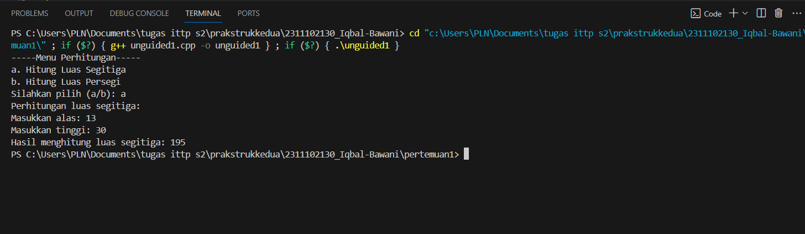
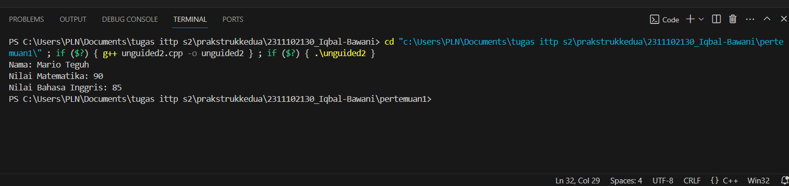
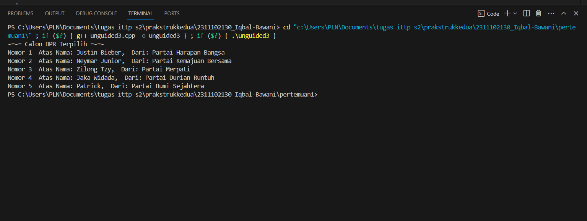

# <h1 align="center">Laporan Praktikum Modul Tipe Data</h1>
<p align="center">Arvinanto Bahtiar</p>
 
## Dasar Teori
 Tipe data primitif adalah tipe data yang sudah ditentukan oleh sistem dan basanya tersedia didalam banyak bahasa pemrograman. Tipe data primitif merupakan blok bangunan fundamental untuk menyimpan nilai-nilai sederhana yang siap di gunakan. Contoh tipe data primitif:

    1.Int (Bilangan bulat)
    2.Float (Bilangan desimal)
    3. Char (Huruf)
    4. Boolean (True/False)


Tipe Data Abstrak

    Tipe data abstrak atau yang biasa disebut Abstrak Data Type merupakan tipe data yang dibentuk oleh programmer itu sendiri. Pada tipe data abstrak bisa berisi banyak tipe data, jadi nilainya bisa lebih dari satu dan beragam tipe data. Pada tipe data abstrak bisa berisi Banyak tipe data, jadi nilainya bisa lebih dari satu dan beragam tipe data. Fitur Class adalah fitur Object Oriented Program(OOP) pada bahasa C++ yang mirip dengan fitur data structures Struct pada bahasa C. Keduanya berfungsi untuk membungkus tipe data di dalamnya sebagai anggota

Tipe Data Koleksi

    Tipe data koleksi (Collection Data Type) adalah tipe data yang digunakan untuk mengelompokkan dan menyimpan beberapa nilai atau objek secara bersamaan. Tipe data koleksi memungkinkan Anda menyimpan, mengelola, dan mengakses sejumlah besar data dengan cara yang terstruktur. Contoh data koleksi:

    1.Array, struktur data statis yang menyimpan elemen-elemen dengan tipe data yang sama
    2.Vector, vector mirip seperti array yang memiliki kemampuan untuk menyimpan data dalam bentuk elemen-elemen yang alokasi memorinya dilakukan otomatis dan bersebelahan
    3.Map, Map terasa mirip dengan array namun dengan index yang memungkinkan untuk berupa tipe data selain integer


## Guided 

### 1. [Tipe Data Primitif]

```C++
#include <iostream>
#include <iomanip>

using namespace std;

// Tipe Data Primitif by Jordan

int main(){
    char op;
    float num1, num2;

    cout << "Enter operator (+, -, *, /): ";
    cin >> op;

    cout << "Enter two operands: ";
    cin >> num1 >> num2;

    switch (op)
    {
    case '+':
        cout << "Result: " << num1 + num2 << endl;
        break;
    case '-':
        cout << "Result: " << num1 - num2 << endl;
        break;
    case '*':
        cout << "Result: " << num1 * num2 << endl;
        break;
    case '/':
        if (num2 == 0) {
            cout << "Result: " << fixed << setprecision(2) << num1 / num2 << endl;
        } else {
            cout << "Error!: Division by zero" << endl;
        }
        break;

    default:
        cout << "Error! operator is not correct" << endl;
        break;
    }
    return 0;
}
```

Program yang Anda berikan adalah kalkulator sederhana yang meminta pengguna memasukkan operator, kemudian melakukan operasi aritmetika sesuai dengan operator yang dimasukkan. Operasi untuk memilih operasi penambahan (+), pengurangan (-), perkalian (*), dan pembagian (/). Keempat operasi ini akan jalan jika user sudah menginput dua angka pada saat penginputan cin. Terdapat juga dua tipe data primitif pada program ini, yaitu char dan float. Tipe data char digunakan pada saat pemilihan switch case dan float digunakan sebagai tipe data 2 angka yang diinput user.


## 2. [Tipe Data Abstrak]

```C++
#include <stdio.h>
#include <string.h>

// Struct
struct Mahasiswa
{
    char name[50];
    char address[50];
    int age;
};

// Tipe Data Abstrak by Jordan

int main() {
    // Menggunakan Struct
    struct Mahasiswa mhs1, mhs2;

    // Mengisi nilai ke struct
    strcpy(mhs1.name, "Dian");
    strcpy(mhs1.address, "Mataram");
    mhs1.age = 22;
    strcpy(mhs2.name, "Bambang");
    strcpy(mhs2.address, "Surabaya");
    mhs2.age = 23;

    // Mencetak isi dari struct
    printf("## Mahasiswa 1 ##\n");
    printf("Nama: %s\n", mhs1.name);
    printf("Alamat: %s\n", mhs1.address);
    printf("Umur: %d\n", mhs1.age);
    printf("\n");
    printf("## Mahasiswa 2 ##\n");
    printf("Nama: %s\n", mhs2.name);
    printf("Alamat: %s\n", mhs2.address);
    printf("Umur: %d\n", mhs2.age);

    return 0;
}
```
Program di atas digunakan untuk mencetak isi dari struct yang  merupakan salah satu contoh dari tipe data abstrak. Terdapat sebuah struct Mahasiswa. Pada struct Mahasiswa ini, terdapat 3 nilai, yaitu char name dengan ukuran 50, char address dengan ukuran 50 juga, dan int age. Lalu pada int main, diisi nilai dan dideklarasikan struct Mahasiswa dengan 2 objek, yaitu mhs1 dengan nama Dian dan mhs2 dengan nama Bambang.

### 3. [Tipe Data Koleksi]

```C++
#include <iostream>
#include <array>
using namespace std;

// Tipe Data Koleksi by Jordan

int main() {
    // Deklarasi dan inisialisasi array
    int nilai[5];
    nilai[0] = 23;
    nilai[1] = 50;
    nilai[2] = 34;
    nilai[3] = 78;
    nilai[4] = 90;

    // Mencetak array dengan tab
    cout << "Isi array pertama : " << nilai[0] << endl;
    cout << "Isi array kedua : " << nilai[1] << endl;
    cout << "Isi array ketiga : " << nilai[2] << endl;
    cout << "Isi array keempat : " << nilai[3] << endl;
    cout << "Isi array kelima : " << nilai[4] << endl;

    return 0;
}
```
 Array merupakan salah satu contoh dari tipe data koleksi.  di atas adakah contoh untuk mencetak isi dari sebuah array. Pada kode di atas, terdapat library array yang membantu proses pemrogramannya. Terdapat array nilai yang dapat menampung 5 nilai, yaitu 23, 50, 34, 78, dan 90; Lalu dideklarasikan di int main.


## Unguided 

### 1. [Buatlah program menggunakan tipe data primitif minimal dua fungsi dan bebas. Menampilkan program, jelaskan program tersebut dan ambil kesimpulan dari materi tipe data primitif!]

```C++
#include <iostream>

using namespace std;

float angkaalas_130, angkabulat_130, angkapanjang_130;
char hurufkoma_130;

// Fungsi untuk menampilkan menu perhitungan
void tampilanmenu_130() {
    cout << "-----Menu Perhitungan-----" << endl;
    cout << "a. Hitung Luas Segitiga" << endl;
    cout << "b. Hitung Luas Persegi" << endl;
    cout << "Silahkan pilih (a/b): ";
    cin >> hurufkoma_130;
}

// Fungsi untuk menghitung luas segitiga
float hitungluassegitiga_130() {
    cout << "Masukkan alas: ";
    cin >> angkaalas_130;
    cout << "Masukkan tinggi: ";
    cin >> angkabulat_130;
    cout << "Hasil menghitung luas segitiga: ";
    return 0.5 * angkaalas_130 * angkabulat_130;
}

// Fungsi untuk menghitung luas persegi
float hitungluaspersegi_130() {
    cout << "Masukkan panjang sisi: ";
    cin >> angkapanjang_130;
    cout << "Hasil menghitung luas persegi: ";
    return angkapanjang_130 * angkapanjang_130;
}

int main() {
    // Memanggil fungsi tampilanmenu_130 untuk menampilkan pilihan menu
    tampilanmenu_130();

    // Melakukan seleksi berdasarkan pilihan menu yang dimasukkan pengguna
    switch (hurufkoma_130) {
    case 'a':
        // Memanggil fungsi hitungluassegitiga_130 jika pilihan menu adalah 'a'
        cout << "Perhitungan luas segitiga:\n" << hitungluassegitiga_130() << endl;
        break;
    case 'b':
        // Memanggil fungsi hitungluaspersegi_130 jika pilihan menu adalah 'b'
        cout << "Perhitungan luas persegi:\n" << hitungluaspersegi_130() << endl;
        break;
    default:
        // Menampilkan pesan jika pilihan menu tidak valid
        cout << "Menu tidak valid." << endl;
        break;
    }

    return 0;
}
```
#### Output:


Kode di atas adalah Program ini adalah kalkulator sederhana untuk menghitung luas segitiga atau luas persegi berdasarkan pilihan pengguna.Program akan meminta pengguna memilih operasi yang ingin dilakukan melalui fungsi tampilanmenu_130. Menu ditampilkan dengan pilihan antara menghitung luas segitiga (pilihan 'a') atau luas persegi (pilihan 'b'). Pengguna diminta untuk memasukkan huruf 'a' atau 'b', yang kemudian disimpan dalam variabel hurufkoma_130. Setelah memilih operasi, program menggunakan struktur kontrol switch untuk mengevaluasi pilihan pengguna. Jika pengguna memilih 'a', fungsi hitungluassegitiga_130 dipanggil untuk meminta masukan alas dan tinggi segitiga, dan menghitung luas segitiga menggunakan rumus 0.5 * alas * tinggi. Hasilnya kemudian ditampilkan. Jika pengguna memilih 'b', fungsi hitungluaspersegi_130 dipanggil untuk meminta masukan panjang sisi persegi, dan menghitung luas persegi dengan mengalikan panjang sisi dengan dirinya sendiri. Hasilnya juga ditampilkan. Dari kode diatas terdapat 2 fungsi dan dua tipe data primitiv yaitu float dan char

Kesimpulan tipe data primitif:
Tipe data primitif merupakan sebuah tipe data yang sudah ditentukan oleh sistem, disediakan oleh banyak bahasa pemrograman, dan merupakan blok bangunan fundamental untuk menyimpan nilai-nilai yang bersifat sederhana. tipe data ini akan serng di jumpai. float, int boolean, dan char adalahcontoh dari tipe data primitif di c++.


### 2. [Jelaskan fungsi dari class dan struct secara detail dan berikan contoh programnya!!]

```C++
#include <iostream>
using namespace std;

// Deklarasi struct
struct NilaiPelajaran {
    int mtk_130;
    int bing_130;
};

// Deklarasi class
class Mahasiswa {
public:
    string nama;
    NilaiPelajaran nilai; // Objek struct sebagai anggota class

    void display() {
        cout << "Nama: " << nama << endl;
        cout << "Nilai Matematika: " << nilai.mtk_130 << endl;
        cout << "Nilai Bahasa Inggris: " << nilai.bing_130 << endl;
    }
};

int main() {
    // Membuat objek John Doe menggunakan struct
    NilaiPelajaran nilaimhs;
    nilaimhs.mtk_130 = 90;
    nilaimhs.bing_130 = 85;

    // Membuat objek Mahasiswa menggunakan class
    Mahasiswa _130;
    _130.nama = "Mario Teguh";
    _130.nilai = nilaimhs;

    // Menampilkan informasi mahasiswa
    _130.display();

    return 0;
}
```
#### Output:


Kode di atas menggunakan struck dan class . struck Nilaipelajaran yang menampung int mtk_130 dan bing_130, class Mahasiswa menampng tipe data string,prosedur void display, dan objek struck sebagai anggota class.

struck:
Struct  dalam  bahasa  C++  merupakan  struktur  data  yang  memungkinkan terjadinya  pembentukan  tipe  data  baru  dengan  menggabungkan  berbagai macam variabel dengan tipe data berbeda yang tersedia dalam C++. jiaka ingin mengelompokan data yang tipe datanya beda maka struck menjadi pilihan

class :
class bisa membuat memungkinkan untuk menggabungkan data (atribut) dan fungsi (metode) bersama-sama dalam suatu unit yang disebut objek


### 3. [ Buat dan jelaskan program menggunakan fungsi map dan jelaskan perbedaan dari array dengan map!!]

```C++
#include <iostream>
#include <map>

using namespace std;

// Struktur data untuk menyimpan informasi calon DPR
struct CalonDPR {
    string nama;
    string partai;
};

int main() {
    // Deklarasi map dengan key int dan value berupa objek CalonDPR
    map<int, CalonDPR> calonDPR_2130;

    // Menambahkan data calon DPR ke dalam map
    calonDPR_2130[1] = {"Justin Bieber", "Partai Harapan Bangsa"};
    calonDPR_2130[2] = {"Neymar Junior", "Partai Kemajuan Bersama"};
    calonDPR_2130[3] = {"Zilong Tzy", "Partai Merpati"};
    calonDPR_2130[4] = {"Jaka Widada", "Partai Durian Runtuh"};
    calonDPR_2130[5] = {"Patrick", "Partai Bumi Sejahtera"};

    cout << "-=-= Calon DPR Terpilih =-=-" << endl;
    // perulangan for untuk menampilkan MAP//
    for (int i = 1; i <= calonDPR_2130.size(); ++i) {
        cout << "Nomor " << i << "  Atas Nama: " << calonDPR_2130[i].nama << ",  Dari: " << calonDPR_2130[i].partai << endl;
    }

    return 0;
}

```
#### Output:


Kode ini merupakan contoh penerapan  struktur data MAP untuk menampilkan informasi calon DPR. struck Calon DPR mendifinisikan  struktur CalonDPR yang memiliki 2string untuk menyimpan nama dan partai. map int, CalonDPR calonDPR_2130;: Mendeklarasikan objek map dengan key berupa integer dan value berupa objek CalonDPR. Nama objek map ini adalah calonDPR_2130.lalu Menambahkan data calon DPR ke dalam map menggunakan calonDPR_2130[key] = nama, partai, dan menggunakan perulangan for untuk menampilkan data yang ada di mapnya.


Perbedaan array dengan map:

-ukuran map dapat did deklarasikan dengan ukuran yang dinamis, sedangkan array harus di deklarasikan dengan ukuran yang tetap.
-kecepatan akses elemen map memerlukan waktu yang lebih lama karena melibatkan pencarian berdasarkan kaca kunci, sedangkan array lebih cepat karena melalui indeks.
-penyusunan data map berdasar kata kunci, sedangkan array indeks, untuk mencari elemen map dengan kata kunci, sedangkan array denagn    numerik 0(untuk rlrmrn pertama)
-map bisa memiliki tipe data yang berbeda sedangkan array tidak.


## Kesimpulan
Map dan array adalah tipe data c++ yang termasuk dalam tipe data koleksi. seorang pemrogram bisa menggunakan map atau array sesuai kebutuhan dan kondisinya masing-masing agar menjadi efisien. Map bisa di dahuulukan jika ada kebutuhan menyimpan tipe data yang berbeda, jia tipe data sama maka di array cenderung lebih di rekomendasikan karena cenderung lebih efisien.Tipe data primitif adalah sebuah tipe data yang sudah di tentukan oleh sistem. struck dan class juga bisa di gunakan sesuai kebutuhan. pemrogram harus bisa memilih dengan baik tipe data seperti apa yang mereka butuhkan agar menjadi lebih efisien.

## Referensi
[1] HANIEF, Shofwan, et al. Konsep Algoritme dan Aplikasinya dalam Bahasa Pemrograman C++. Penerbit Andi, 2020.
[2]Putra, M. T. D., Munawir, M., & Yuniarti, A. R. (2023). BELAJAR PEMROGRAMAN LANJUT DENGAN C++.