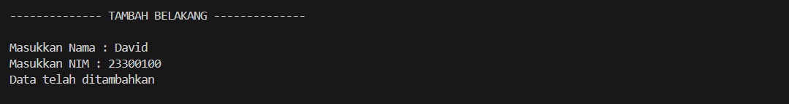

# <h1 align="center">Laporan Praktikum Modul Crcular dan Non Circular</h1>
<p align="center">Iqbal bawani - 2311102130 </p>
 
## Dasar Teori

linked list adalah suatu simpul (node) yang dikaitkan dengan simpul yang lain dalam suatu urutan tertentu. Suatu simpul dapat berbentuk suatu struktur atau class. Simpul harus mempunyai satu atau lebih elemen struktur atau class yang berisi data. Secara teori, linked list adalah sejumlah node yang dihubungkan secara linier dengan bantuan pointer. Elemen pada awal list (head) dan elemen pada akhir list (tail). Link list umumnya di bagi menjadi 2 macam seperti linked list single list dan linked list doble list. Dikatakan single linked apabila hanya ada satu pointer yang menghubungkan setiap node single. linked list merupakan sebuah struktur data yang digunakan untuk menyimpan sejumlah objek data biasanya secara terurut sehingga memungkinkan penambahan, pengurangan, dan pencarian atas elemen data yang tersimpan dalam senarai dilakukan secara lebih efektif.

single Link list Dalam operasi Single Linked List, umumnya dilakukan operasi penambahan dan penghapusan simpul pada awal atau akhir daftar, serta pencarian dan pengambilan nilai pada simpul tertentu dalam daftar. Karena struktur data ini hanya memerlukan satu pointer untuk setiap simpul, maka Single Linked List umumnya lebih efisien dalam penggunaan memori dibandingkan dengan jenis Linked List lainnya. ada beberapa jenisnya seperti :

1. Single LinkedList Non CircularSetiap  node  pada  linked  list  mempunyai field   yang   berisi   data   dan   pointer   ke   node berikutnya & ke node sebelumnya.Untuk pembentukan node baru, mulanya pointer next dan prev  akan  menunjuk  ke  nilai  NULL.Selanjutnya pointer  prev  akan  menunjuk  ke  node  sebelumnya, dan pointer next akan menunjukke node selanjutnya pada list.Linked list non circular merupakan linked list dengan node pertama (head) dan  node terakhir (tail) yang tidak saling terhubung. Pointer terakhir (tail) pada Linked  List ini selalu bernilai ‘NULL’ sebagai pertanda data terakhir dalam list-nya.

2. Single Linked list CircularSingle Linked List yang pointer nextnya menunjuk pada dirinya sendiri.Jika Single Linked List tersebut terdiri dari beberapa node, maka pointer next pada node terakhir akan menunjuk ke node terdepannya. Linked list circular merupakan linked list yang tidak memiliki akhir karena node terakhir (tail) tidak bernilai ‘NULL’, tetapi terhubung dengan node pertama (head). 
Saat menggunakan linked list circular kita membutuhkan dummy node atau node pengecoh yang biasanya dinamakan dengan node current supaya program dapat berhenti menghitung data ketika node current mencapai node pertama (head). Linked list circular dapat digunakan untuk menyimpan data yang perlu diakses secara berulang, seperti daftar putar lagu, daftar pesan dalam antrian, atau  penggunaan memori berulang dalam suatu aplikasi
## Guided 


### 1. [Latihan linked list Non Circular]

```
#include <iostream>
using namespace std;

// Deklarasi struct node
struct Node {
    int data;
    Node *next;
};

Node *head;
Node *tail;

// Inisialisasi node
void init() {
    head = NULL;
    tail = NULL;
}

// Pengecekan apakah kosong
bool isEmpty() {
    if (head == NULL)
        return true;
    else
        return false;
}

// Tambah depan
void insertDepan(int nilai) {
    // Buat node baru
    Node *baru = new Node;
    baru->data = nilai;
    baru->next = NULL;
    if (isEmpty()) {
        head = tail = baru;
        tail->next = NULL;
    } else {
        baru->next = head;
        head = baru;
    }
}

// Tambah belakang
void insertBelakang(int nilai) {
    // Buat node baru
    Node *baru = new Node;
    baru->data = nilai;
    baru->next = NULL;
    if (isEmpty()) {
        head = tail = baru;
        tail->next = NULL;
    } else {
        tail->next = baru;
        tail = baru;
    }
}

// Hitung jumlah list
int hitungList() {
    Node *hitung = head;
    int jumlah = 0;
    while (hitung != NULL) {
        jumlah++;
        hitung = hitung->next;
    }
    return jumlah;
}

// Tambah tengah
void insertTengah(int data, int posisi) {
    if (posisi < 1 || posisi > hitungList()) {
        cout << "Posisi di luar jangkauan" << endl;
    } else if (posisi == 1) {
        cout << "Posisi bukan posisi tengah" << endl;
    } else {
        Node *baru, *bantu;
        baru = new Node();
        baru->data = data;

        // Transversing
        bantu = head;
        int nomor = 1;
        while (nomor < posisi - 1) {
            bantu = bantu->next;
            nomor++;
        }
        baru->next = bantu->next;
        bantu->next = baru;
    }
}

// Hapus depan
void hapusDepan() {
    Node *hapus;
    if (!isEmpty()) {
        if (head->next != NULL) {
            hapus = head;
            head = head->next;
            delete hapus;
        } else {
            head = tail = NULL;
        }
    } else {
        cout << "List kosong" << endl;
    }
}

// Hapus tengah
void hapusTengah(int posisi) {
    Node *bantu, *hapus, *sebelum;
    if (posisi < 1 || posisi > hitungList()) {
        cout << "Posisi di luar jangkauan" << endl;
    } else if (posisi == 1) {
        cout << "Posisi bukan posisi tengah" << endl;
    } else {
        int nomor = 1;
        bantu = head;
        while (nomor <= posisi) {
            if (nomor == posisi - 1) {
                sebelum = bantu;
            }
            if (nomor == posisi) {
                hapus = bantu;
            }
            bantu = bantu->next;
            nomor++;
        }
        sebelum->next = bantu;
        delete hapus;
    }
}

// Ubah depan
void ubahDepan(int data) {
    if (!isEmpty()) {
        head->data = data;
    } else {
        cout << "List masih kosong!" << endl;
    }
}

// Ubah tengah
void ubahTengah(int data, int posisi) {
    Node *bantu;
    if (!isEmpty()) {
        if (posisi < 1 || posisi > hitungList()) {
            cout << "Posisi di luar jangkauan" << endl;
        } else if (posisi == 1) {
            cout << "Posisi bukan posisi tengah" << endl;
        } else {
            bantu = head;
            int nomor = 1;
            while (nomor < posisi) {
                bantu = bantu->next;
                nomor++;
            }
            bantu->data = data;
        }
    } else {
        cout << "List masih kosong!" << endl;
    }
}

// Ubah belakang
void ubahBelakang(int data) {
    if (!isEmpty()) {
        tail->data = data;
    } else {
        cout << "List masih kosong!" << endl;
    }
}

// Hapus semua list
void clearList() {
    Node *bantu, *hapus;
    bantu = head;
    while (bantu != NULL) {
        hapus = bantu;
        bantu = bantu->next;
        delete hapus;
    }
    head = tail = NULL;
    cout << "List berhasil terhapus!" << endl;
}

// Tampilkan list
void tampil() {
    Node *bantu;
    bantu = head;
    if (!isEmpty()) {
        while (bantu != NULL) {
            cout << bantu->data << " ";
            bantu = bantu->next;
        }
        cout << endl;
    } else {
        cout << "List masih kosong!" << endl;
    }
}

int main() {
    init();
    insertDepan(3);
    tampil();
    insertBelakang(5);
    tampil();
    insertDepan(2);
    tampil();
    insertDepan(1);
    tampil();
    hapusDepan();
    tampil();
    hapusTengah(2);
    tampil();
    insertTengah(7, 2);
    tampil();
    hapusTengah(2);
    tampil();
    ubahDepan(1);
    tampil();
    ubahBelakang(8);
    tampil();
    ubahTengah(11, 2);
    tampil();
    return 0;
}

```
Kode di atas merupakan implementasi dari struktur data linked list Non circular. Dalam program tersebut, sebuah struct Node didefinisikan yang memiliki dua anggota: data untuk menyimpan nilai integer dan next untuk menunjukkan ke node berikutnya dalam linked list. Selanjutnya, program juga mendefinisikan dua pointer, yaitu head dan tail, yang digunakan untuk menandai awal dan akhir dari linked list. Fungsi init() digunakan untuk menginisialisasi linked list dengan mengatur kedua pointer tersebut menjadi NULL, menandakan bahwa linked list saat itu kosong. Berbagai fungsi untuk mengelola linked list, seperti menambahkan elemen di depan (insertDepan()), menambahkan elemen di belakang (insertBelakang()), menghitung jumlah elemen dalam linked list (hitungList()), menambahkan elemen pada posisi tertentu (insertTengah()), menghapus elemen pertama (hapusDepan()), menghapus elemen pada posisi tertentu (hapusTengah()), mengubah nilai data dari elemen pertama, tengah, dan terakhir (ubahDepan(), ubahTengah(), ubahBelakang()), menghapus semua elemen dalam linked list (clearList()), dan menampilkan seluruh elemen dalam linked list (tampil()).


## 2. [Latihan Linked List Circular]

```C++
#include <iostream>
using namespace std;

// Deklarasi Struct Node
struct Node{
    string data;
    Node* next;
};

Node* head, * tail, * baru, * bantu, * hapus;

//Inisialisasi node head & tail
void init(){
    head = NULL;
    tail = head;
}

//Pengecekan isi list
int isEmpty(){
    if (head == NULL){
        return 1; // true
    } else {
        return 0; // false
    }
}

//Buat Node Baru
void buatNode(string data){
    baru = new Node;
    baru->data = data;
    baru->next = NULL;
}

//Hitung List
int hitungList(){
    bantu = head;
    int jumlah = 0;
    while (bantu != NULL) {
        jumlah++;
        bantu = bantu->next;
    }
    return jumlah;
}

//Tambah Depan
void insertDepan(string data){
    // Buat Node baru
    buatNode(data);

    if (isEmpty() == 1){
        head = baru;
        tail = head;
        baru->next = head;
    } else {
        while (tail->next != head){
            tail = tail->next;
        }
        baru->next = head;
        head = baru;
        tail->next = head;
    }
}

//Tambah Belakang
void insertBelakang(string data){
    // Buat Node baru
    buatNode(data);

    if (isEmpty() == 1){
        head = baru;
        tail = head;
        baru->next = head;
    } else {
        while (tail->next != head){
            tail = tail->next;
        }
        tail->next = baru;
        baru->next = head;
    }
}

//Tambah Tengah
void insertTengah(string data, int posisi){
    if (isEmpty() == 1){
        head = baru;
        tail = head;
        baru->next = head;
    } else {
        baru->data = data;
        // transversing
        int nomor = 1;
        bantu = head;
        while (nomor < posisi - 1){
            bantu = bantu->next;
            nomor++;
        }
        baru->next = bantu->next;
        bantu->next = baru;
    }
}

//Hapus Depan
void hapusDepan(){
    if (isEmpty() == 0){
        hapus = head;
        tail = head;
        if (hapus->next == head){
            head = NULL;
            tail = NULL;
            delete hapus;
        } else {
            while (tail->next != hapus){
                tail = tail->next;
            }
            head = head->next;
            tail->next = head;
            hapus->next = NULL;
            delete hapus;
        }
    } else {
        cout << "List masih kosong!" << endl;
    }
}

//Hapus Belakang
void hapusBelakang(){
    if (isEmpty() == 0){
        hapus = head;
        tail = head;
        if (hapus->next == head){
            head = NULL;
            tail = NULL;
            delete hapus;
        } else {
            while (hapus->next != head){
                hapus = hapus->next;
            }
            while (tail->next != hapus){
                tail = tail->next;
            }
            tail->next = head;
            hapus->next = NULL;
            delete hapus;
        }
    } else {
        cout << "List masih kosong!" << endl;
    }
}

// Hapus Tengah
void hapusTengah(int posisi){
    if (isEmpty() == 0){
        // transversing
        int nomor = 1;
        bantu = head;
        while (nomor < posisi - 1){
            bantu = bantu->next;
            nomor++;
        }
        hapus = bantu->next;
        bantu->next = hapus->next;
        delete hapus;
    } else {
        cout << "List masih kosong!" << endl;
    }
}

//Hapus List
void clearList(){
    if (head != NULL){
        hapus = head->next;
        while (hapus != head){
            bantu = hapus->next;
            delete hapus;
            hapus = bantu;
        }
        delete head;
        head = NULL;
    }
    cout << "List berhasil terhapus!" << endl;
}

//Tampilkan List
void tampil(){
    if (isEmpty() == 0){
        tail = head;
        do {
            cout << tail->data << ends;
            tail = tail->next;
        } while (tail != head);
        cout << endl;
    } else {
        cout << "List masih kosong!" << endl;
    }
}

int main(){
    init();
    insertDepan("Ayam");
    tampil();
    insertDepan("Bebek");
    tampil();
    insertBelakang("Cicak");
    tampil();
    insertBelakang("Domba");
    tampil();
    hapusBelakang();
    tampil();
    hapusDepan();
    tampil();
    insertTengah("Sapi", 2);
    tampil();
    hapusTengah(2);
    tampil();
    
    return 0;
}
```
kode diatas menggunakan implementasi circular linked list dengan menggunakan struktur data yang terdiri dari beberapa fungsi operasi dasar seperti penambahan di depan dan belakang, penghapusan di depan, belakang, dan tengah, serta penghitungan jumlah elemen dan penampilan keseluruhan elemen dalam list. Dalam program ini, setiap node memiliki dua bagian: data dan pointer yang menunjuk ke node berikutnya. Fungsi-fungsi operasi tersebut kemudian diuji dalam fungsi main() dengan melakukan sejumlah operasi pada linked list yang telah dibuat untuk menguji fungsionalitasnya. Program ini memberikan pengguna kemampuan untuk mengelola list secara dinamis dengan berbagai operasi dasar yang tersedia.


## Unguided 
### Buatlah program menu Linked List Non Circular untuk menyimpan Nama dan NIM Mahasiswa, dengan meggunakan Input dari User

### 1. Buatlah menu untuk menambahkan,mengubah,menghapus dan melihat Nama dan NIM Mahasiswa. Berikut contoh tampilan output dari nomor 1:


```C++
// UNGUIDED 1
// Iqbal Bawani
// S1 IF-11-D
// 2311102130

#include <iostream>
using namespace std;

// Struktur untuk node dalam linked list
struct Node {
    string nama;
    string nim;
    Node* next;
};

// Class untuk mengelola linked list
class LinkedList {
private:
    Node* head; // Pointer ke head dari linked list

public:
    // Constructor untuk menginisialisasi linked list
    LinkedList() : head(nullptr) {}

    // Fungsi untuk menambahkan data di depan linked list
    void tambahDepan(string nama, string nim) {
        Node* newNode = new Node(); // Membuat node baru
        newNode->nama = nama; // Menetapkan nilai nama untuk node baru
        newNode->nim = nim; // Menetapkan nilai nim untuk node baru
        newNode->next = head; // Menunjukkan pointer next node baru ke head
        head = newNode; // Mengatur head baru menjadi node baru
        cout << "Data telah ditambahkan" << endl; // Memberi pesan bahwa data telah ditambahkan
    }
    // Fungsi untuk menambahkan data ke belakang linked list
    void tambahBelakang(string nama, string nim) {
        Node* newNode = new Node(); // Membuat node baru
        newNode->nama = nama; // Menetapkan nilai nama untuk node baru
        newNode->nim = nim; // Menetapkan nilai nim untuk node baru
        newNode->next = nullptr; // Menunjukkan bahwa node baru adalah node terakhir
        if (head == nullptr) { // Jika linked list masih kosong
            head = newNode; // Atur head baru menjadi node baru
            return; // Keluar dari fungsi
        }
        Node* temp = head;
        while (temp->next != nullptr) { // Melakukan iterasi sampai menemukan node terakhir
            temp = temp->next;
        }
        temp->next = newNode; // Menghubungkan node terakhir dengan node baru
        cout << "Data telah ditambahkan" << endl; // Memberi pesan bahwa data telah ditambahkan
    }

    // Fungsi untuk menambahkan data di tengah linked list
    void tambahTengah(string nama, string nim, int posisi) {
        Node* newNode = new Node(); // Membuat node baru
        newNode->nama = nama; // Menetapkan nilai nama untuk node baru
        newNode->nim = nim; // Menetapkan nilai nim untuk node baru

        if (posisi == 1) { // Jika posisi yang diminta adalah posisi pertama
            tambahDepan(nama, nim); // Panggil fungsi tambahDepan untuk menambahkan di depan
            return; // Keluar dari fungsi
        }

        Node* temp = head;
        for (int i = 1; i < posisi - 1 && temp != nullptr; i++) { // Melakukan iterasi untuk mencari node sebelum posisi yang diminta
            temp = temp->next;
        }

        if (temp == nullptr) { // Jika posisi yang diminta melebihi panjang linked list
            cout << "Posisi diluar jangkauan" << endl; // Memberi pesan bahwa posisi diluar jangkauan
            return; // Keluar dari fungsi
        }

        newNode->next = temp->next; // Menghubungkan node baru dengan node setelahnya
        temp->next = newNode; // Menghubungkan node sebelumnya dengan node baru
        cout << "Data telah ditambahkan" << endl; // Memberi pesan bahwa data telah ditambahkan
    }
    // Fungsi untuk mengubah data di depan linked list
    void ubahDepan(string namaBaru, string nimBaru) {
        if (head == nullptr) { // Jika linked list kosong
            cout << "Linked list kosong." << endl; // Menampilkan pesan bahwa linked list kosong
            return; // Keluar dari fungsi
        }

        head->nama = namaBaru; // Mengubah nilai nama pada node pertama
        head->nim = nimBaru; // Mengubah nilai nim pada node pertama
        cout << "Data telah diubah" << endl; // Menampilkan pesan bahwa data telah diubah
    }

    // Fungsi untuk mengubah data di belakang linked list
    void ubahBelakang(string namaBaru, string nimBaru) {
        if (head == nullptr) { // Jika linked list kosong
            cout << "Linked list kosong." << endl; // Menampilkan pesan bahwa linked list kosong
            return; // Keluar dari fungsi
        }

        Node* temp = head;
        while (temp->next != nullptr) { // Melakukan iterasi untuk mencari node terakhir
            temp = temp->next;
        }

        temp->nama = namaBaru; // Mengubah nilai nama pada node terakhir
        temp->nim = nimBaru; // Mengubah nilai nim pada node terakhir
        cout << "Data telah diubah" << endl; // Menampilkan pesan bahwa data telah diubah
    }

    // Fungsi untuk mengubah data di tengah linked list berdasarkan posisi
    void ubahTengah(string namaBaru, string nimBaru, int posisi) {
        if (head == nullptr) { // Jika linked list kosong
            cout << "Linked list kosong." << endl; // Menampilkan pesan bahwa linked list kosong
            return; // Keluar dari fungsi
        }

        Node* temp = head;
        int counter = 1;
        while (temp != nullptr && counter != posisi) { // Melakukan iterasi untuk mencari node pada posisi yang diminta
            temp = temp->next;
            counter++;
        }

        if (temp == nullptr) { // Jika posisi melebihi panjang linked list
            cout << "Posisi diluar jangkauan" << endl; // Menampilkan pesan bahwa posisi diluar jangkauan
            return; // Keluar dari fungsi
        }

        temp->nama = namaBaru; // Mengubah nilai nama pada node yang ditemukan
        temp->nim = nimBaru; // Mengubah nilai nim pada node yang ditemukan
        cout << "Data telah diubah" << endl; // Menampilkan pesan bahwa data telah diubah
    }


        // Fungsi untuk menghapus data dari depan linked list
    void hapusDepan() {
        if (head == nullptr) { // Jika linked list kosong
            cout << "Linked list kosong." << endl; // Menampilkan pesan bahwa linked list kosong
            return; // Keluar dari fungsi
        }

        Node* temp = head; // Simpan pointer ke node pertama
        head = head->next; // Pindahkan head ke node berikutnya
        delete temp; // Hapus node pertama
        cout << "Data berhasil dihapus" << endl; // Menampilkan pesan bahwa data berhasil dihapus
    }

    // Fungsi untuk menghapus data dari belakang linked list
    void hapusBelakang() {
        if (head == nullptr) { // Jika linked list kosong
            cout << "Linked list kosong." << endl; // Menampilkan pesan bahwa linked list kosong
            return; // Keluar dari fungsi
        }

        if (head->next == nullptr) { // Jika linked list hanya memiliki satu node
            cout << "Data (" << head->nama << ") berhasil dihapus" << endl; // Menampilkan nama mahasiswa yang dihapus
            delete head; // Hapus node pertama
            head = nullptr; // Atur head menjadi nullptr
            return; // Keluar dari fungsi
        }

        Node* temp = head;
        while (temp->next->next != nullptr) { // Melakukan iterasi sampai menemukan node sebelum node terakhir
            temp = temp->next;
        }
        cout << "Data (" << temp->next->nama << ") berhasil dihapus" << endl; // Menampilkan nama mahasiswa yang dihapus
        delete temp->next; // Hapus node terakhir
        temp->next = nullptr; // Atur pointer next dari node sebelumnya menjadi nullptr
    }


    // Fungsi untuk menghapus data di tengah linked list berdasarkan posisi
    void hapusTengah(int posisi) {
        if (head == nullptr) { // Jika linked list kosong
            cout << "Linked list kosong." << endl; // Menampilkan pesan bahwa linked list kosong
            return; // Keluar dari fungsi
        }

        if (posisi == 1) { // Jika posisi yang diminta adalah posisi pertama, panggil fungsi hapusDepan
            hapusDepan();
            return; // Keluar dari fungsi
        }

        Node* temp = head;
        Node* prev = nullptr;
        int counter = 1;
        while (temp != nullptr && counter != posisi) { // Melakukan iterasi sampai menemukan node pada posisi yang diminta
            prev = temp;
            temp = temp->next;
            counter++;
        }

        if (temp == nullptr) { // Jika posisi melebihi panjang linked list
            cout << "Posisi diluar jangkauan" << endl; // Menampilkan pesan bahwa posisi diluar jangkauan
            return; // Keluar dari fungsi
        }

        if (prev != nullptr) { // Jika node sebelumnya tidak kosong (bukan node pertama)
            prev->next = temp->next; // Menghubungkan node sebelumnya dengan node setelahnya
            cout << "Data (" << temp->nama << ") berhasil dihapus" << endl; // Menampilkan nama mahasiswa yang dihapus
        } else { // Jika node sebelumnya kosong (node yang dihapus adalah node pertama)
            head = temp->next; // Atur head ke node berikutnya
            cout << "Data (" << temp->nama << ") berhasil dihapus" << endl; // Menampilkan nama mahasiswa yang dihapus
        }

        delete temp; // Hapus node pada posisi yang diminta
    }


    // Fungsi untuk menampilkan seluruh data dalam linked list
    void tampilkanData() {
        if (head == nullptr) { // Jika linked list kosong
            cout << "Linked list kosong." << endl; // Menampilkan pesan bahwa linked list kosong
            return; // Keluar dari fungsi
        }

        cout << "DATA MAHASISWA" << endl; // Menampilkan label data
        cout << "NAMA\tNIM" << endl; // Menampilkan header
        Node* temp = head;
        while (temp != nullptr) { // Melakukan iterasi untuk menampilkan setiap node dalam linked list
            cout << temp->nama << "\t" << temp->nim << endl; // Menampilkan data node
            temp = temp->next; // Beralih ke node berikutnya
        }
    }

    // Fungsi untuk menghapus seluruh data dalam linked list
    void hapusList() {
        while (head != nullptr) { // Melakukan iterasi sampai linked list kosong
            Node* temp = head; // Simpan pointer ke node pertama
            head = head->next; // Pindahkan head ke node berikutnya
            delete temp; // Hapus node yang disimpan
        }
        cout << "Seluruh data telah dihapus" << endl; // Menampilkan pesan bahwa seluruh data telah dihapus
    }

};

int main() {
    LinkedList linkedList;
    int choice;
    string nama, nim;
    int posisi;

    do {
        cout << "\n------- PROGRAM SINGLE LINKED LIST -------" << endl;
        cout << "-------------- NON-CIRCULAR --------------" << endl; 
        cout << " 1. TAMBAH DEPAN                        " << endl;
        cout << " 2. TAMBAH BELAKANG                     " << endl;
        cout << " 3. TAMBAH TENGAH                       " << endl;
        cout << " 4. UBAH DEPAN                          " << endl;
        cout << " 5. UBAH BELAKANG                       " << endl;
        cout << " 6. UBAH TENGAH                         " << endl;
        cout << " 7. HAPUS DEPAN                         " << endl;
        cout << " 8. HAPUS BELAKANG                      " << endl;
        cout << " 9. HAPUS TENGAH                        " << endl;
        cout << " 10. HAPUS LIST                         " << endl;
        cout << " 11. TAMPILKAN                          " << endl;
        cout << " 0. KELUAR                              " << endl;
        cout << " Keluar dari program                    " << endl;
        cout << "------------------------------------------" << endl;
        cout << "Pilih Operasi : ";
        cin >> choice;

        switch (choice) {
            case 1:
                cout << "\n-------------- TAMBAH DEPAN --------------\n" << endl;
                cout << "Masukkan Nama : ";
                cin >> nama;
                cout << "Masukkan NIM : ";
                cin >> nim;
                linkedList.tambahDepan(nama, nim);
                break;
            case 2:
                cout << "\n-------------- TAMBAH BELAKANG --------------\n" << endl;
                cout << "Masukkan Nama : ";
                cin >> nama;
                cout << "Masukkan NIM : ";
                cin >> nim;
                linkedList.tambahBelakang(nama, nim);
                break;
            case 3:
                cout << "\n-------------- TAMBAH TENGAH --------------\n" << endl;
                cout << "Masukkan Nama : ";
                cin >> nama;
                cout << "Masukkan NIM : ";
                cin >> nim;
                cout << "Masukkan Posisi : ";
                cin >> posisi;
                linkedList.tambahTengah(nama, nim, posisi);
                break;
            case 4:
                cout << "\n-------------- UBAH DEPAN --------------\n" << endl;
                cout << "Masukkan Nama Baru : ";
                cin >> nama;
                cout << "Masukkan NIM Baru : ";
                cin >> nim;
                linkedList.ubahDepan(nama, nim);
                break;
            case 5:
                cout << "\n-------------- UBAH BELAKANG --------------\n" << endl;
                cout << "Masukkan Nama Baru : ";
                cin >> nama;
                cout << "Masukkan NIM Baru : ";
                cin >> nim;
                linkedList.ubahBelakang(nama, nim);
                break;
            case 6:
                cout << "\n-------------- UBAH TENGAH --------------\n" << endl;
                cout << "Masukkan Nama Baru : ";
                cin >> nama;
                cout << "Masukkan NIM Baru : ";
                cin >> nim;
                cout << "Masukkan Posisi : ";
                cin >> posisi;
                linkedList.ubahTengah(nama, nim, posisi);
                break;
            case 7:
                linkedList.hapusDepan();
                break;
            case 8:
                linkedList.hapusBelakang();
                break;
            case 9:
                cout << "Masukkan Posisi : ";
                cin >> posisi;
                linkedList.hapusTengah(posisi);
                break;
            case 10:

                linkedList.hapusList();
                break;
            case 11:

                linkedList.tampilkanData();
                break;
            case 0:

                cout << "Terima kasih!" << endl;
                break;
            default:
                cout << "Pilihan tidak valid." << endl;
        }
    } while (choice != 0);

    return 0;
}

```
#### Output:

#### Tampilan menu :

#### Menampilkan Jawad dan kawannya

####  Tambah wati diantara Farrel dan Denis

#### Hapus Denis

#### Tambah Owi dan david


#### Ubah Data Idin

#### Ubah Data Lucy

#### Ubah Bagas

#### Hapus data akhir

#### Tampilkan seluruhnya


Kode diatas implementasi dari struktur data linked list non-circular, setiap node memiliki dua bagian utama: data dan pointer yang menunjuk ke node berikutnya. Kelas `LinkedList` memiliki fungsi-fungsi untuk mengelola linked list seperti menambah, mengubah, dan menghapus data, serta menampilkan seluruh data yang ada dalam linked list. Fungsi-fungsi tersebut diimplementasikan dengan memanipulasi pointer `head` yang menunjuk ke node pertama dalam linked list. Fungsi `tambahDepan()`, `tambahBelakang()`, dan `tambahTengah()` digunakan untuk menambahkan data ke dalam linked list, sedangkan fungsi `ubahDepan()`, `ubahBelakang()`, dan `ubahTengah()` digunakan untuk mengubah data dalam linked list. Selain itu, terdapat pula fungsi `hapusDepan()`, `hapusBelakang()`, dan `hapusTengah()` untuk menghapus data dari linked list, serta fungsi `tampilkanData()` untuk menampilkan seluruh data yang ada dalam linked list. `do-while` dalam fungsi `main()` untuk memberikan pengguna pilihan operasi yang ingin dilakukan pada linked list. Setiap pilihan operasi akan memanggil fungsi-fungsi yang sesuai dari objek `linkedList`. Pengguna dapat menambahkan data di depan, belakang, atau di tengah linked list, mengubah data di depan, belakang, atau di tengah linked list, menghapus data dari depan, belakang, atau di tengah linked list, serta menampilkan seluruh data yang ada dalam linked list. Program akan terus berjalan sampai pengguna memilih untuk keluar dari program dengan memilih opsi "0". Dengan demikian, program ini memberikan pengguna kemampuan untuk mengelola linked list non-circular secara dinamis sesuai dengan kebutuhan mereka.


## Kesimpulan
Kesimpulannya, Single linked list circular memiliki koneksi langsung antara elemen terakhir dan elemen pertama, memungkinkan navigasi langsung tanpa perhitungan tambahan. Sedangkan single linked list non-circular tidak memiliki koneksi langsung antara elemen terakhir dan elemen pertama; elemen terakhir menunjuk ke NULL sebagai penanda akhir dari list, sehingga navigasi dari elemen terakhir ke elemen pertama memerlukan perhitungan tambahan. Dalam linked list non-circular, setiap elemen disebut node, yang terdiri dari data dan pointer yang menunjuk ke node berikutnya. Kelebihan utama linked list non-circular adalah kemampuannya untuk menangani penambahan dan penghapusan elemen dengan efisien tanpa memerlukan alokasi memori statis. Hal ini memungkinkan pengguna untuk menambahkan atau menghapus elemen di tengah linked list dengan cepat, tanpa perlu memindahkan atau mengubah elemen-elemen lainnya. Selain itu, linked list non-circular juga memungkinkan alokasi memori yang dinamis, sehingga ukuran list dapat disesuaikan dengan kebutuhan secara fleksibel. Namun, linked list non-circular memiliki kelemahan dalam akses elemen secara acak, karena akses ke elemen tertentu memerlukan pencarian dari awal list. 

## Referensi
[1]SIREGAR, Anugrah Ananda Nauli. Pengertian Linked Object. 2019.
[2]TRIASE, Triase. Struktur Data: Diktat Edisi Revisi. 2020.
[3]Arraffi, Adzriel. “PENGERTIAN LINIER DALAM STRUKTUR DATA MAJEMUK.” OSF Preprints, 30 Mar. 2019. Web