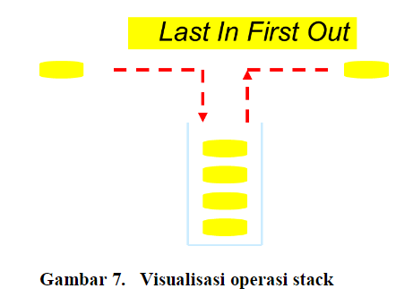
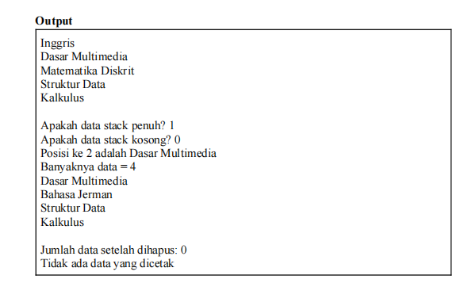
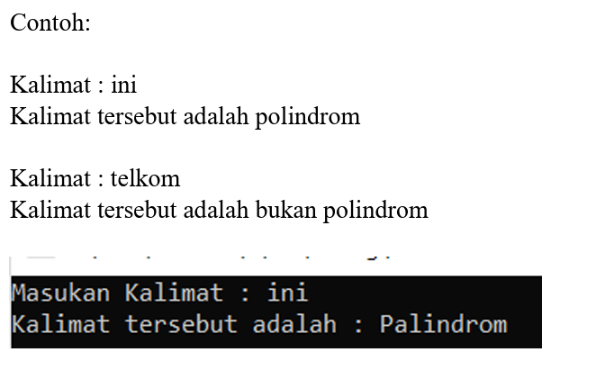
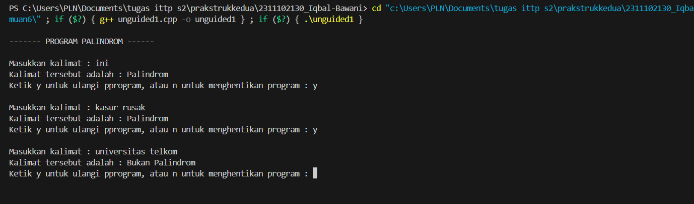
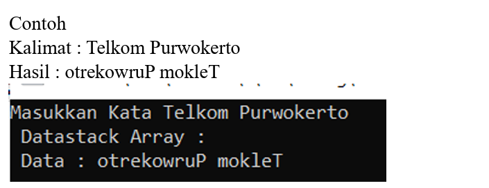
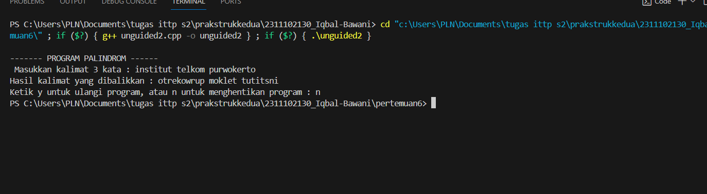

# <h1 align="center">Laporan Praktikum 6  Modul Stack</h1>
<p align="center">Iqbal bawani - 2311102130 </p>
 
## Dasar Teori

Pengertian StackStack atau  tumpukan  adalah  suatu  stuktur data    yang    penting    dalam    pemrogramandengan   metode   pemrosesan   yang   bersifat LIFO (Last  In  First  Out)dimana  objek/benda yang  terakhir  masuk  ke  dalam stackakan menjadi  benda pertama  yang  dikeluarkan  dari stack.Dengan  model  demikian,  maka  hanya bagian  paling  atas  saja  dari stack(TOP)  yang bisa   di   akses. Salah   satu   kelebihan stackadalah  bahwa  struktur  data  tersebut  dapat  di implementasikan   baik   pada array   maupun pada linked list.  Fungsi k struktur data ini lebih sering digunakan sebagai programmer’s tool. Yaitu, digunakan sebagai alat bantu konseptual penyimpanan data, bukan sebagai penyimpanan data itu sendiri.
Stack, lebih abstrak dibandingkan dengan struktur penyimpanan data seperti arrays dan beberapa yang lainnya. Mekanisme mendasar untuk
mengimplementasikan stack,  dapat berupa Arrays sebagaimana yang ditunjukkan pada pembahasan guided modul ini dan juga bisa langsung menggunakan librarynya. 

beberapa Operasi yang umum digunakan pada stack :
- Push (Masukkan) : Menambahkan atau Memasukkan elemen ke dalam tumpukan posisi paling atas.
- Pop (Keluarkan) : Menghapus atau Mengeluarkan elemen dari posisi sangat atas tumpukan.
- Top (Atas) : Melihat elemen teratas pada tumpukan tanpa menghapusnya.
- IsEmpty (Kosong): Mengecek apakah tumpukan kosong ataupun tidak.
- IsFull (Penuh) : Mengecek apakah tumpukan penuh ataupun tidak (paling utama pada implementasi tumpukan dengan kapasitas terbatas).
- Size (Ukuran) : Mengembalikan jumlah elemen yang terdapat dalam tumpukan.
- Peek (Lihat) : Melihat elemen pada posisi tertentu dalam tumpukan tanpa menghapusnya.
- Clear (Membersihkan) :  Mengosongkan atau menghapus semua elemen dari tumpukan.
- Search (Cari): Mencari keberadaan elemen tertentu dalam tumpukan.

 


## Guided 
### 1. [Latihan Stack implementasinya menggunakan array (operasi stack)]
```C++
#include <iostream>//Library standard
using namespace std;

string arrayBuku[5]; // Mendefinisikan array untuk menyimpan data stack
int maksimal = 5, top = 0; // Variabel maksimal menunjukkan ukuran maksimal stack, top adalah indeks di mana elemen berikutnya akan dimasukkan


// Fungsi untuk mengecek apakah stack penuh
bool isFull() {
    return (top == maksimal);
}

// Fungsi untuk mengecek apakah stack kosong
bool isEmpty() {
    return (top == 0);
}


// Fungsi untuk memasukkan data ke dalam stack
void pushArrayBuku(string data) {
    if (isFull()) {
        cout << "Data telah penuh" << endl;
    } else {
        arrayBuku[top] = data;
        top++;
    }
}

// Fungsi untuk menghapus data dari stack
void popArrayBuku() {
    if (isEmpty()) {
        cout << "Tidak ada data yang dihapus" << endl;
    } else {
        arrayBuku[top - 1] = "";
        top--;
    }
}

// Fungsi untuk melihat data pada posisi tertentu dalam stack
void peekArrayBuku(int posisi) {
    if (isEmpty()) {
        cout << "Tidak ada data yang bisa dilihat" << endl;
    } else {
        int index = top;
        for (int i = 1; i <= posisi; i++) {
            index--;
        }
        cout << "Posisi ke " << posisi << " adalah " <<
            arrayBuku[index] << endl;
    }
}

// Fungsi untuk menghitung jumlah data dalam stack
int countStack() {
    return top;
}

// Fungsi untuk mengubah data pada posisi tertentu dalam stack
void changeArrayBuku(int posisi, string data) {
    if (posisi > top) {
        cout << "Posisi melebihi data yang ada" << endl;
    } else {
        int index = top;
        for (int i = 1; i <= posisi; i++) {
            index--;
        }
        arrayBuku[index] = data;
    }
}


// Fungsi untuk menghapus semua data dalam stack
void destroyArraybuku() {
    for (int i = top; i >= 0; i--) {
        arrayBuku[i] = "";
    }
    top = 0;
}

// Fungsi untuk mencetak semua data dalam stack
void cetakArrayBuku() {
    if (isEmpty()) {
        cout << "Tidak ada data yang dicetak" << endl;
    } else {
        for (int i = top - 1; i >= 0; i--) {
            cout << arrayBuku[i] << endl;
        }
    }
}


// Fungsi utama
int main() {
    // Memasukkan beberapa data ke dalam stack
    pushArrayBuku("Kalkulus");
    pushArrayBuku("Struktur Data");
    pushArrayBuku("Matematika Diskrit");
    pushArrayBuku("Dasar Multimedia");
    pushArrayBuku("Inggris");

    // Mencetak semua data dalam stack
    cetakArrayBuku();
    cout << "\n";

    // Menampilkan status apakah stack penuh atau kosong
    cout << "Apakah data stack penuh? " << isFull() << endl;
    cout << "Apakah data stack kosong? " << isEmpty() << endl;

    // Melihat data pada posisi tertentu dalam stack
    peekArrayBuku(2);

    // Menghapus satu data dari stack
    popArrayBuku();

    // Menghitung jumlah data dalam stack
    cout << "Banyaknya data = " << countStack() << endl;

    // Mengubah data pada posisi tertentu dalam stack
    changeArrayBuku(2, "Bahasa Jerman");

    // Mencetak semua data dalam stack setelah ada perubahan
    cetakArrayBuku();
    cout << "\n";

    // Menghapus semua data dalam stack
    destroyArraybuku();
    cout << "Jumlah data setelah dihapus: " << top << endl;

    // Mencetak semua data dalam stack setelah dihapus
    cetakArrayBuku();

    return 0;
}

```
## output 


Kode diatas adalah salah satu implementasi  struktur data stack diimplementasikan secara manual menggunakan array dan indeks top sebagai penanda posisi atas (top) dari stack dan mengelola array secara manual, termasuk penanganan untuk kasus ketika stack penuh atau kosong, serta penanganan untuk operasi-operasi dasar seperti push, pop, dan peek. Program ini menunjukkan penggunaan operasi dasar pada stack seperti push (memasukkan data), pop (menghapus data), peek (melihat data pada posisi tertentu), dan operasi lainnya seperti menghitung jumlah data, mengubah data, dan menghapus semua data dalam stack.

## Unguided 1
### 1.  Buatlah program untuk menentukan apakah kalimat tersebut yang diinputkan dalam program stack adalah palindrom/tidak. Palindrom kalimat yang dibaca dari depan dan belakang sama. Jelaskan bagaimana cara kerja programnya.


```C++

// Iqbal Bawani
// 2311102138
// S1 IF-11-D

#include <iostream>//library standart
#include <stack>// linbrary stack

using namespace std;

// Fungsi untuk mengecek apakah sebuah string merupakan palindrom atau bukan
bool Palindrom(string Kata) { // Mendefinisikan fungsi Palindrom dengan parameter string Kata
    stack<char> StackKata; // Membuat objek stack untuk menyimpan karakter-karakter dari string Kata
    int Length = Kata.length(); // Menghitung panjang string Kata

    // Menyimpan setengah pertama kata dalam tumpukan
    for (int i = 0; i < Length / 2; i++) { // Melakukan iterasi untuk setengah pertama dari panjang kata
        StackKata.push(Kata[i]); // Menyimpan karakter ke dalam tumpukan
    }
    
    int Mulai = Length / 2; // Inisialisasi variabel Mulai dengan setengah panjang kata.
    if (Length % 2 != 0) { // Jika panjang kata ganjil, tambahkan 1 ke nilai Mulai.
        Mulai++;
    }


    // Membandingkan setengah kedua kata dengan isi tumpukan
    for (int i = Mulai; i < Length; i++) {
        if (StackKata.empty() || Kata[i] != StackKata.top()) {
            return false; // Jika terdapat perbedaan, bukan palindrom
        }
        StackKata.pop(); // Lanjut ke karakter berikutnya
    }

    return true; // Jika berhasil melewati semua pengecekan, kata merupakan palindrom
}

int main() {
    char ulangi;
    cout << "\n------- PROGRAM PALINDROM ------" << endl;
    // Memulai perulangan untuk menginput dan mengecek kalimat palindrom
    do {
        string Kata;
        cout << "\nMasukkan kalimat : ";
        getline(cin, Kata); // Meminta pengguna untuk memasukkan sebuah kalimat

        // Memanggil fungsi Palindrom() untuk mengecek apakah kalimat tersebut adalah palindrom atau bukan
        if (Palindrom(Kata)) {
            cout << "Kalimat tersebut adalah : Palindrom" << endl;
        } else {
            cout << "Kalimat tersebut adalah : Bukan Palindrom" << endl;
        }
        // ulangi program
        cout << "Ketik y untuk ulangi pprogram, atau n untuk menghentikan program : ";
        cin >> ulangi;
        cin.ignore(); // Membersihkan newline character dari input buffer
    } while (ulangi == 'y' ); // Melakukan perulangan selama pengguna ingin mencoba kalimat lain

    return 0; // Mengakhiri program
}

```
## output :



Program kode  mengimplementasikan sebuah fungsi untuk mengecek apakah sebuah string merupakan palindrom atau tidak. Ini cukup berbeda dengan yang ada di guided, pada unguided ke 1 ini kita menggunakan objek stack dari library stack. Pertama, program mendefinisikan fungsi `Palindrom()` yang menerima sebuah string `Kata` sebagai parameter. Di dalam fungsi ini, sebuah objek stack dengan tipe `char` dibuat menggunakan library `<stack>` untuk menyimpan karakter-karakter dari setengah pertama string `Kata`. Setelah itu, program melakukan iterasi sepanjang setengah panjang string `Kata`, memasukkan setiap karakter dari setengah pertama ke dalam stack. Variabel `Mulai` dihitung sebagai setengah panjang `Kata`, dan jika panjang `Kata` ganjil, nilai `Mulai` ditambah 1 untuk memulai pengecekan dari karakter setelah setengah panjang.  Selanjutnya, program membandingkan setiap karakter dari setengah kedua string `Kata` dengan isi stack. Jika ada perbedaan, maka string `Kata` tidaklah palindrom. Namun, jika semua karakter cocok dengan karakter yang disimpan di stack, maka string `Kata` adalah palindrom. Pada bagian `main()` program, sebuah loop `do-while` digunakan untuk memungkinkan pengguna mengulangi program.


## Unguided 2
### 2.  Buatlah program untuk melakukan pembalikan terhadap kalimat menggunakanstack dengan minimal 3 kata. Jelaskan output program dan source codenyabeserta operasi/fungsi yang dibuat? 


```C++
//Iqbal Bawani
//2311102130
//S1-IF-11D


#include <iostream>// library standart
#include <stack>//Library stack ,(Charstack)

using namespace std;

// Prosedur untuk membalikkan kalimat menggunakan stack
void palindrom_130(stack<char>& CharStack, const string& Kalimat) {  // Mengisi stack dengan setiap karakter dari string
    for (char c : Kalimat) {
        CharStack.push(c);
    }

    while (!CharStack.empty()) {  // Mengeluarkan karakter dari stack dan mencetaknya untuk membalikkan kalimat
        cout << CharStack.top();  // Mencetak karakter teratas dari stack
        CharStack.pop(); // Menghapus karakter teratas dari stack
    }
}

int main() {
    stack<char> CharStack; // Mendeklarasikan stack yang akan digunakan untuk membalikkan karakter-karakter dari kalimat
    char ulangi; // Variabel untuk menyimpan pilihan pengguna untuk mengulangi program atau tidak

    cout << "\n------- PROGRAM PALINDROM ------" << endl; // Menampilkan pesan pembuka program

    do {
        string Kalimat; // Variabel untuk menyimpan kalimat yang dimasukkan oleh pengguna
        cout << " Masukkan kalimat minimal 3 kata : "; // Meminta pengguna untuk memasukkan kalimat
        getline(cin, Kalimat); // Membaca kalimat yang dimasukkan oleh pengguna

        cout << "Hasil kalimat yang dibalikkan : "; // Menampilkan pesan sebelum mencetak hasil pembalikan kalimat
        palindrom_130(CharStack, Kalimat); // Memanggil fungsi untuk membalikkan kalimat dan mencetak hasilnya
        cout << endl; // Menampilkan baris baru setelah hasil pembalikan kalimat

        cout << "Ketik y untuk ulangi program, atau n untuk menghentikan program : "; // Meminta pengguna untuk memilih apakah akan mengulangi program atau tidak
        cin >> ulangi; // Membaca pilihan pengguna
        cin.ignore(); // Mengabaikan karakter newline ('\n') yang tersisa di buffer input
    } while (ulangi == 'y'); // Melakukan loop selama pengguna ingin mengulangi program

    return 0; // Mengakhiri program dengan nilai kembali 0
}


```
## Output:



 kode diatas adalaha kode program implementasi stack pada c++ .implementasi library stack ada pada charStack yang ada pada prosedur void palindrom_130 .Tumpukan yang menyediakan operasi-operasi standar seperti push , pop , dan mungkin juga operasi-operasi lain seperti peek, isEmpty, dan lain-lain.. Pada parameter prosedur void palindrom_130 (stack<char>& CharStack, const string& Kalimat)ini mengambil dua argumen, stack<char>& CharStack yang akan digunakan untuk menyimpan karakter-karakter dari kalimat. const string& Kalimat Ini adalah string yang akan dibalikkan. pada perulangan di prosedur, for (char c : Kalimat) adalah loop yang akan mengambil setiap karakter c dari string Kalimat. Ini akan dilakukan untuk setiap karakter dalam string Kalimat. pada perulangan for CharStack.push(c): Di dalam loop, setiap karakter c dimasukkan ke dalam stack CharStack menggunakan fungsi push(). Ini berarti karakter pertama dari string Kalimat akan menjadi yang teratas di dalam stack, yang akan membuatnya menjadi yang terakhir yang dicetak. Kemudian perulangan while (!CharStack.empty())adalah loop yang akan terus berjalan selama stack CharStack tidak kosong. Artinya, loop akan terus berjalan sampai semua karakter dari string Kalimat sudah dicetak. cout << CharStack.top(): Di dalam loop, karakter teratas dari stack CharStack dicetak menggunakan cout. Karakter ini adalah karakter terakhir dari string Kalimat, karena kita telah membalikkan urutan karakter dengan memasukkannya ke dalam stack. CharStack.pop(): Setelah karakter teratas dicetak, karakter tersebut dihapus dari stack menggunakan fungsi pop(). Ini dilakukan agar karakter berikutnya yang akan dicetak adalah karakter sebelumnya dalam urutan asli. Pada int main kita buat  loop do while agar pengguna bisa mengulangi program.


## Kesimpulan
Kesimpulannya, Stack atau tumpukan menggunakan konsep Last In Frist Out . Pada stack terdapat beberapa istilah dan fungsi yang dapat digunakan antara lain top, isEmpty, isFull, push, pop, size, peek, serta clear yang dapat di padukan dengan array. Selain itu stack juga bisa langsung menggunakan librarynya 

## Referensi
[1]Sihombing, J. (2019). Penerapan Stack Dan Queue Pada Array Dan Linked List Dalam Java. INFOKOM (Informatika & Komputer), 7(2), 15-24.
[2]HOLLE, Khadijah Fahmi Hayati. Modul praktikum struktur data. 2022.

