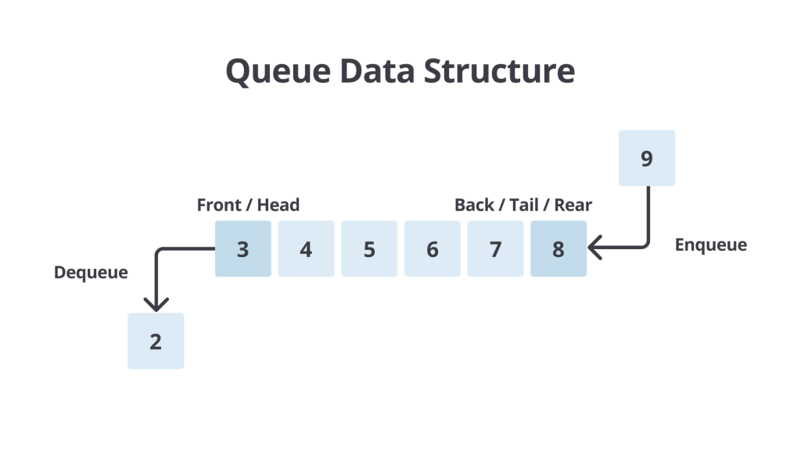
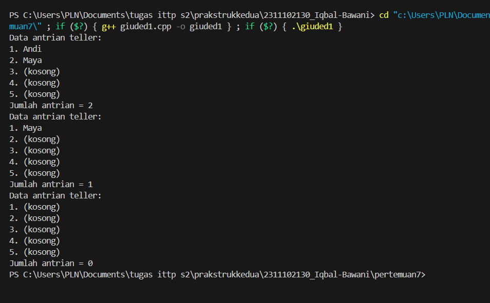
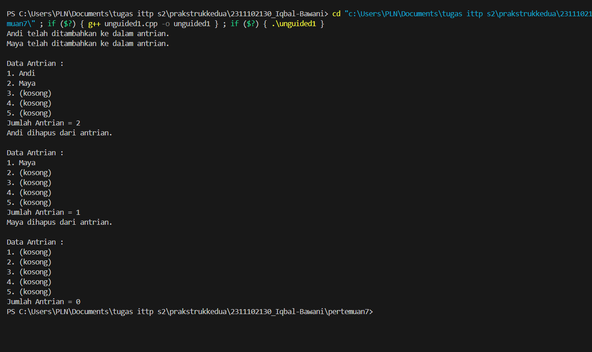
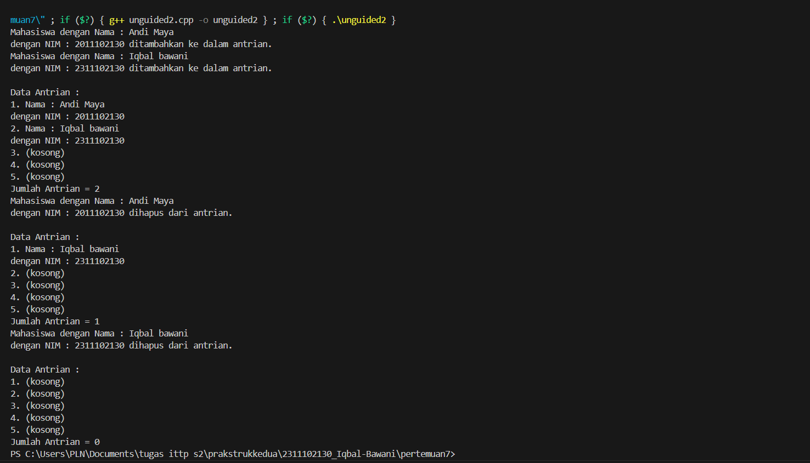

# <h1 align="center">Laporan Praktikum 7  Modul Queue</h1>
<p align="center">Iqbal bawani - 2311102130 </p>
 
## Dasar Teori

Queue adalah struktur data yang digunakan untuk menyimpan data dengan metode FIFO (First-In First-Out). Data yang pertama dimasukkan ke dalam queue akan menjadi data yang pertama pula untuk dikeluarkan dari queue. Queue mirip dengan konsep antrian pada kehidupan sehari-hari, dimana konsumen yang datang lebih dulu akan dilayani terlebih dahulu. Implementasi queue dapat dilakukan dengan menggunakan array atau linked list. Struktur data queue terdiri dari dua pointer yaitu front dan rear. Front/head adalah pointer ke elemen pertama dalam queue dan rear/tail/back adalah pointer ke elemen terakhir dalam queue.



Perbedaan antara stack dan queue terdapat pada aturan penambahan dan penghapusan elemen. Pada stack, operasi penambahan dan penghapusan elemen dilakukan di satu ujung. Elemen yang terakhir diinputkan akan berada paling dengan dengan ujung atau dianggap paling atas sehingga pada operasi penghapusan, elemen teratas tersebut akan dihapus paling awal, sifat demikian dikenal dengan LIFO. Pada Queue, operasi tersebut dilakukan ditempat berbeda (melalui salah satu ujung) karena perubahan data selalu mengacu pada Head, maka hanya ada 1 jenis insert maupun delete. Prosedur ini sering disebut Enqueue dan Dequeue pada kasus Queue. Untuk Enqueue, cukup tambahkan elemen setelah elemen terakhir Queue, dan untuk Dequeue, cukup "geser"kan Head menjadi elemen selanjutnya.
Operasi pada Queue
-● enqueue() : menambahkan data ke dalam queue.
-● dequeue() : mengeluarkan data dari queue.
-● peek() : mengambil data dari queue tanpa menghapusnya.
-● isEmpty() : mengecek apakah queue kosong atau tidak.
-● isFull() : mengecek apakah queue penuh atau tidak.
-● size() : menghitung jumlah elemen dalam queue.</br>

Queue memiliki beberapa fungsi penting dalam pemrograman diantaranya:<br>

-a. Mengatur Urutan: Menjaga urutan tugas, yang pertama masuk adalah yang pertama keluar. Seperti antrian nyata.
-b. Penjadwalan: Membantu mengatur pekerjaan berdasarkan prioritas atau urutan, berguna saat banyak tugas.
-c. Buffering: Sementara menyimpan data cepat sebelum diproses lebih lanjut.
-d. Algoritma: Berguna dalam algoritma seperti BFS yang menjelajahi langkah demi langkah.
-e. Simulasi: Digunakan dalam model antrian di dunia nyata, contohnya pesawat atau antrian belanja.
-f. Pengelolaan Memori: Mengontrol penggunaan sumber daya seperti memori.
-g. Aplikasi Chat: Membantu mengatur pesan sebelum ditampilkan.
-h. Manajemen Proses: Mengatur proses yang akan dieksekusi oleh komputer.
-i. Sistem Antrian: Dipakai di bank, rumah sakit, dll., mengatur giliran pelanggan


## Guided 
### 1. [Latihan queue di padukan array]
```C++
#include <iostream>
using namespace std;

const int maksimalQueue = 5; // Maksimal antrian
int front = 0; // Penanda antrian
int back = 0; // Penanda
string queueTeller[5]; // Fungsi pengecekan

bool isFull() { // Pengecekan antrian penuh atau tidak
    if (back == maksimalQueue) {
        return true; // =1
    } else {
        return false;
    }
}

bool isEmpty() { // Antriannya kosong atau tidak
    if (back == 0) {
        return true;
    } else {
        return false;
    }
}

void enqueueAntrian(string data) { // Fungsi menambahkan antrian
    if (isFull()) {
        cout << "Antrian penuh" << endl;
    } else {
        if (isEmpty()) { // Kondisi ketika queue kosong
            queueTeller[0] = data;
            front++;
            back++;
        } else { // Antrianya ada isi
            queueTeller[back] = data;
            back++;
        }
    }
}

void dequeueAntrian() { // Fungsi mengurangi antrian
    if (isEmpty()) {
        cout << "Antrian kosong" << endl;
    } else {
        for (int i = 0; i < back; i++) {
            queueTeller[i] = queueTeller[i + 1];
        }
        back--;
    }
}

int countQueue() { // Fungsi menghitung banyak antrian
    return back;
}

void clearQueue() { // Fungsi menghapus semua antrian
    if (isEmpty()) {
        cout << "Antrian kosong" << endl;
    } else {
        for (int i = 0; i < back; i++) {
            queueTeller[i] = "";
        }
        back = 0;
        front = 0;
    }
}

void viewQueue() { // Fungsi melihat antrian
    cout << "Data antrian teller:" << endl;
    for (int i = 0; i < maksimalQueue; i++) {
        if (queueTeller[i] != "") {
            cout << i + 1 << ". " << queueTeller[i] << endl;
        } else {
            cout << i + 1 << ". (kosong)" << endl;
        }
    }
}

int main() {
    enqueueAntrian("Andi");
    enqueueAntrian("Maya");
    viewQueue();
    cout << "Jumlah antrian = " << countQueue() << endl;
    dequeueAntrian();
    viewQueue();
    cout << "Jumlah antrian = " << countQueue() << endl;
    clearQueue();
    viewQueue();
    cout << "Jumlah antrian = " << countQueue() << endl;
    return 0;
}

```
## output 


Kode diatas merupakan implementasi struktur data queue. pertama kode mendefinisikan konstanta MaksimalAntrian yang menentukan ukuran maksimal antrian yang ditampung, lalu dua variabel front dan back yang digunakan untuk menunjukan bagian depan da belakang. Fungsi isFull() digunakan untuk melihat apakah antrian penuh atau tidak, isEmpty() untuk memeriksa apakah antrian masih kosong, TambahData() untuk menambah data antrian, KurangAntrian() untuk menghapus antrian, Count() untuk menampilkan seluruh antrian dan ClearQueue() untuk menghapus semua antrian

## Unguided 1
### 1.  Ubahlah penerapan konsep queue pada bagian guided dari array menjadi linked list

```C++
// IQBAL BAWANI
// 2311102130
// S1 IF-11-D

#include <iostream>
using namespace std;

const int maksimalQueue = 5;  // Maksimal antrian adalah 5

// Node untuk menyimpan data dan pointer ke node berikutnya
struct Node {
    string data; //menyimpan data
    Node* next; //pointer ke node selanjutnya
};

class Queue {
private:
    Node* front; // Node depan 
    Node* rear;  // Node belakang 

public: 
    Queue() { // Konstruktor untuk menginisialisasi antrian kosong
        front = nullptr; // Inisialisasi front dengan nullptr
        rear = nullptr; // Inisialisasi rear dengan nullptr
    }

    //menambahkan data ke antrian
    void enqueue_130(const string& data) {
        Node* newNode = new Node;
        newNode->data = data;
        newNode->next = nullptr;
        
        // Jika antrian kosong
        if (isEmpty()) { // Jika antrian kosong maka front dan rear menunjuk ke newNode yang baru dibuat 
            front = rear = newNode;
        } else { // Jika antrian tidak kosong maka rear menunjuk ke newNode yang baru dibuat
            rear->next = newNode;
            rear = newNode;
        }
        
        cout << data << " telah ditambahkan ke dalam antrian." << endl;
    }

    //menghapus data dari antrian
    void dequeue() {
        if (isEmpty()) { // Jika antrian kosong 
            cout << "Antrian kosong." << endl;
            return;
        }

        Node* temp = front; // Simpan node front ke dalam variabel temp untuk dihapus nantinya 
        front = front->next; // Geser front ke node selanjutnya 

        cout << temp->data << " dihapus dari antrian." << endl; // Tampilkan data yang dihapus dari antrian 
        delete temp; // Hapus node yang disimpan di variabel temp

        // Jika setelah penghapusan antrian menjadi kosong
        if (front == nullptr) {
            rear = nullptr;
        }
    }

    //menampilkan seluruh antrian
    void displayQueue() {
        if (isEmpty()) { // Jika antrian kosong 
            cout << "\nData Antrian :" << endl;
            for (int i = 0; i < maksimalQueue; i++) {
                cout << i + 1 << ". (kosong)" << endl;
            }
        } else { // Jika antrian tidak kosong 
            cout << "\nData Antrian :" << endl;
            Node* current = front;
            int i = 1;
            while (current != nullptr) { // Selama current tidak menunjuk ke nullptr maka tampilkan data antrian yang ada 
                cout << i << ". " << current->data << endl;
                current = current->next;
                i++;
            }
            for (; i <= maksimalQueue; i++) { // Tampilkan pesan "(kosong)" untuk antrian yang kosong 
                cout << i << ". (kosong) " << endl;
            }
        }
    }

    //memeriksa apakah antrian kosong
    bool isEmpty() {
        return front == nullptr;
    }

    //mengembalikan jumlah elemen dalam antrian
    int countQueue() {
        int count = 0;
        Node* current = front;
        while (current != nullptr) { 
            count++;
            current = current->next;
        }
        return count; // Kembalikan jumlah elemen dalam antrian
    }

    //menghapus semua elemen dalam antrian
    void clearQueue() {
        while (!isEmpty()) { // Selama antrian tidak kosong maka hapus elemen dalam antrian
            dequeue(); // Hapus elemen dalam antrian 
        } 
        cout << "Antrian telah dibersihkan." << endl;
    }
};

int main() {
    Queue queue; // Buat objek queue dari class Queue
    queue.enqueue_130("Andi");
    queue.enqueue_130("Maya");
    queue.displayQueue();
    cout << "Jumlah Antrian = " << queue.countQueue() << endl;
    queue.dequeue();
    queue.displayQueue();
    cout << "Jumlah Antrian = " << queue.countQueue() << endl;
    queue.dequeue();
    queue.displayQueue();
    cout << "Jumlah Antrian = " << queue.countQueue() << endl;

    return 0;
}

```
## output :



Program kode mengimplementasikan sebuah antrian dalam bentuk linked list, Berbeda dengan guided yang menggunakan arrray yang artinya setiap elemen di representasikansebagai simpul node yang terhubung satu sama lain. Setiap simpul (node) dalam linked list memiliki dua bagian data (dalam hal ini, string) dan pointer ke simpul berikutnya. Ketika elemen baru ditambahkan ke antrian (enqueue), simpul baru dibuat dan ditambahkan di belakang antrian. Ketika elemen dihapus dari antrian (dequeue), simpul di depan antrian dihapus. Fungsi enqueue(const string& data)untuk Menambahkan elemen baru ke dalam antrian, dequeue() untuk Menghapus elemen dari depan antrian.
displayQueue()untuk Menampilkan seluruh elemen yang ada dalam antrian,  isEmpty() untuk Memeriksa apakah antrian kosong.
countQueue()untuk Mengembalikan jumlah elemen dalam antrian, clearQueue() untuk Menghapus semua elemen dari antrian, sehingga membersihkannya.


## Unguided 2
### 2.  Dari nomor 1 buatlah konsep antri dengan atribut Nama mahasiswa dan NIM Mahasiswa

```C++
//IQBAL BAWANI
// 2311102130
// S1 IF-11-D

#include <iostream>
using namespace std;

const int maksimalQueue = 5;  // Maksimal antrian adalah 5

struct Node { // Node untuk menyimpan data dan pointer ke node berikutnya
    string Nama; // Menyimpan nama mahasiswa
    string NIM; // Menyimpan NIM mahasiswa
    Node* next; // Pointer ke node berikutnya
};

class Queue {
private:
    Node* front; // Node depan 
    Node* rear;  // Node belakang 

public: 
    Queue() { // Konstruktor untuk menginisialisasi antrian kosong
        front = nullptr; // Inisialisasi front dengan nullptr
        rear = nullptr; // Inisialisasi rear dengan nullptr
    }

    void enqueue_130(const string& Nama, const string& NIM) {
        Node* newNode = new Node; // Buat node baru
        newNode->Nama = Nama; // Isi data Nama pada node baru
        newNode->NIM = NIM; // Isi data NIM pada node baru
        newNode->next = nullptr; // Atur pointer next node baru menjadi nullptr
        
        // Jika antrian kosong
        if (isEmpty()) { // Jika antrian kosong maka front dan rear menunjuk ke newNode yang baru dibuat 
            front = rear = newNode;
        } else { // Jika antrian tidak kosong maka rear menunjuk ke newNode yang baru dibuat
            rear->next = newNode;
            rear = newNode;
        }
        
        cout << "Mahasiswa dengan Nama : " << newNode->Nama << "\ndengan NIM : " << newNode->NIM << " ditambahkan ke dalam antrian." << endl;
    }

    //menghapus data dari antrian
    void dequeue() {
        if (isEmpty()) { // Jika antrian kosong 
            cout << "Antrian kosong." << endl;
            return;
        }

        Node* temp = front; // Simpan node front ke dalam variabel temp untuk dihapus nantinya 
        front = front->next; // Geser front ke node selanjutnya 

        cout << "Mahasiswa dengan Nama : " << temp->Nama << "\ndengan NIM : " << temp->NIM << " dihapus dari antrian." << endl; // Tampilkan data mahasiswa yang dihapus dari antrian 
        delete temp; // Hapus node yang disimpan di variabel temp

        // Jika setelah penghapusan antrian menjadi kosong
        if (front == nullptr) {
            rear = nullptr;
        }
    }

    //menampilkan seluruh antrian
    void displayQueue() {
        if (isEmpty()) { // Jika antrian kosong 
            cout << "\nData Antrian :" << endl;
            for (int i = 0; i < maksimalQueue; i++) {
                cout << i + 1 << ". (kosong)" << endl;
            }
        } else { // Jika antrian tidak kosong 
            cout << "\nData Antrian :" << endl;
            Node* current = front;
            int i = 1;
            while (current != nullptr) { // Selama current tidak menunjuk ke nullptr maka tampilkan data antrian yang ada 
                cout << i << ". " << "Nama : " << current->Nama << "\ndengan NIM : " << current->NIM << endl;
                current = current->next;
                i++;
            }
            for (; i <= maksimalQueue; i++) { // Tampilkan pesan "(kosong)" untuk antrian yang kosong 
                cout << i << ". (kosong)" << endl;
            }
        }
    }

    //memeriksa apakah antrian kosong
    bool isEmpty() {
        return front == nullptr;
    }

    // mengembalikan jumlah elemen dalam antrian
    int countQueue() {
        int count = 0;
        Node* current = front;
        while (current != nullptr) { 
            count++;
            current = current->next;
        }
        return count; // Kembalikan jumlah elemen dalam antrian
    }

    //menghapus semua elemen dalam antrian
    void clearQueue() {
        while (!isEmpty()) { // Selama antrian tidak kosong 
            dequeue(); // Hapus elemen dalam antrian 
        } 
        cout << "Antrian telah dibersihkan." << endl;
    }
};

int main() {
    Queue queue; // Buat objek queue dari class Queue
    queue.enqueue_130("Andi Maya", "2011102130");
    queue.enqueue_130("Iqbal bawani", "2311102130");
    queue.displayQueue();
    cout << "Jumlah Antrian = " << queue.countQueue() << endl;
    queue.dequeue();
    queue.displayQueue();
    cout << "Jumlah Antrian = " << queue.countQueue() << endl;
    queue.dequeue();
    queue.displayQueue();
    cout << "Jumlah Antrian = " << queue.countQueue() << endl;

    return 0;
}

```
## Output:



 kode diatas adalaha kode program implementasi queue pada c++. Pada dasarnya kode unguided 2 merupakan kode unguided 1 dengan sedikit perubahan dan perbedaan. misalnya kode unguided ke 1 , setiap simpul (node) dalam linked list hanya menyimpan satu data, yaitu string.
Pada unguided kedua, setiap simpul (node) menyimpan dua data, yaitu Nama dan NIM, keduanya bertipe string. Tentunya dengan beberapa hal berbeda akan menghasilkan output yang berbeda. Kode diatas akan menghasilkan output nama dan nim. Fungsi-fungsi utama seperti enqueue, dequeue, displayQueue, isEmpty, countQueue, dan clearQueue pada dasarnya sama antara kedua program. Namun, perbedaan terletak pada cara data Nama dan NIM diakses dan ditampilkan.


## Kesimpulan
Kesimpulannya, Queue memiliki karakter yang berbeda dengan stack, stack mimliki karakter last in first out sedangkan queue memiliki karakter first ini first out  yang artinya yang pertama masuk maka yang pertama juga keluarnya. Queue bisa di kombinasikan dengan array maupun linked list. Queue bersifat seperti antrian 

## Referensi
[1]ERKAMIM, Erkamim, et al. Buku Ajar Algoritma dan Struktur Data. PT. Sonpedia Publishing Indonesia, 2024.</br>
[2] Mulyana, A. (2023). E-Books Cara Mudah Mempelajari Algoritma dan Struktur Data.</br>

