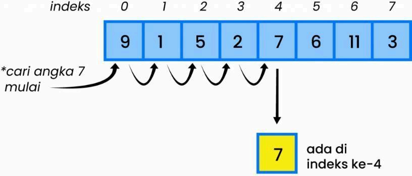
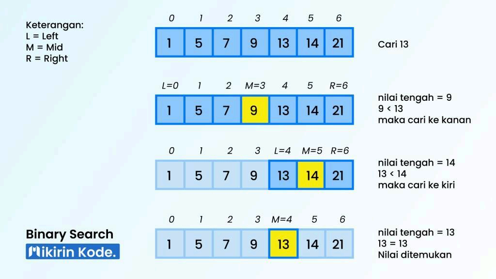
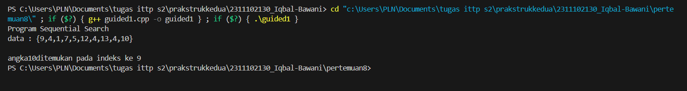
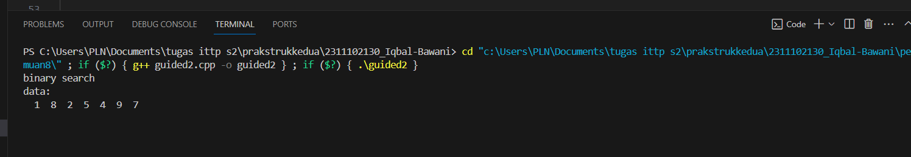
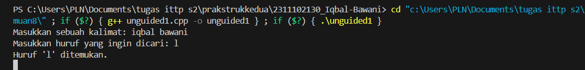
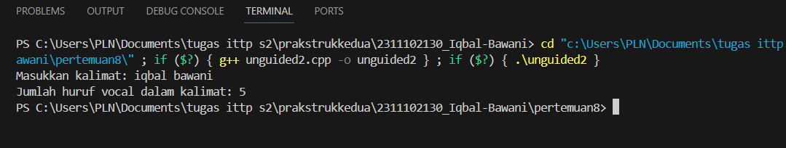
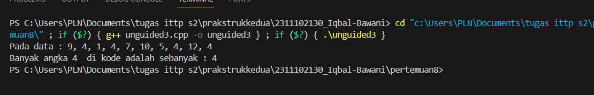

# <h1 align="center">Laporan Praktikum 8  Modul Agoritma Searching</h1>
<p align="center">Iqbal bawani - 2311102130 </p>
 
#### Dasar Teori

Pencarian (Searching) yaitu proses menemukan suatu nilai tertentu pada kumpulan data. Hasil pencarian adalah salah satu dari tiga keadaan ini: data ditemukan, data ditemukan lebih dari satu, atau data tidak ditemukan. Searching juga dapat dianggap sebagai proses pencarian suatu data di dalam sebuah array dengan cara mengecek satu persatu pada setiap index baris atau setiap index kolomnya dengan
menggunakan teknik perulangan untuk melakukan pencarian data.

## Sequential Search
Sequential search adalah metode pencarian paling sederhana. Proses pencarian sequential yaitu dengan membandingkan setiap elemen array satu per satu secara beruntun, dimulai dengan elemen pertama, sampai elemen yang dicari ditemukan atau sampai elemen terakhir dari array. Pencarian sekuensial dapat dilakukan pada elemen array yang tidak diurutkan atau pada elemen array yang diurutkan. Perbedaan  antara keduanya terletak pada efisiensi operasi perbandingan yang dilakukan. Dengan begitu, proses pencarian sequential akan singkat  jika data yang diolah sedikit, dan jika data yang diolah banyak, prosesnya akan lama. Maka, metode ini direkomendasikan  untuk  data  yang sedikit.Konsep Sequential Search yaitu:</br>
● Membandingkan setiap elemen pada array satu per satu secara berurut.</br>
● Proses pencarian dimulai dari indeks pertama hingga indeks terakhir.</br>
● Proses pencarian akan berhenti apabila data ditemukan. Jika hingga akhir array data masih juga tidak ditemukan, maka proses pencarian tetap akan dihentikan.</br>
● Proses perulangan pada pencarian akan terjadi sebanyak jumlah N elemen pada array.<br>
Algoritma pencarian berurutan dapat dituliskan sebagai berikut :</br>
1) i ← 0</br>
2) ketemu ← false</br>
3) Selama (tidak ketemu) dan (i <= N) kerjakan baris 4</br>
4) Jika (Data[i] = x) maka ketemu ← true, jika tidak i ← i + 1></br>
5) Jika (ketemu) maka i adalah indeks dari data yang dicari, jika tidak data tidak
ditemukan</br>

Contoh dari Sequential Search, yaitu: Int A[8] = {9,1,5,2,7,6,11,3}

Misalkan, dari data di atas angka yang akan dicari adalah angka 7 dalam array A, maka proses yang akan terjadi yaitu:</br>
● Pencarian dimulai pada index ke-0 yaitu angka 9, kemudian dicocokkan dengan angka yang akan dicari, jika tidak sama maka pencarian akan dilanjutkan ke index selanjutnya.</br>
● Pada index ke-1, yaitu angka 1, juga bukan angka yang dicari, maka pencarian akan dilanjutkan pada index selanjutnya.</br>
● Pada index ke-2 dan index ke-3 yaitu angka 5 dan 2, juga bukan angka yang dicari, sehingga pencarian dilanjutkan pada index selanjutnya.</br>
● Pada index ke-4 yaitu angka 7 dan ternyata angka 7 merupakan angka yang dicari, sehingga pencarian akan dihentikan dan proses selesai.</br>

## Binay search
Pencarian Bagi dua (Binary Search)</br>
Pencarian bagidua (binary search) adalah prosespencarian dengan membagi dua bagian data kemudian
membandingkan isi data bagian pertama atau bagian kedua dengan data yang akan dicari. Pada metode ini
membutuhkan nilai indeks terkecil dan terbesar untuk dijumlahkan kemudian dibagi dua. Pencarian bagi dua
(binary search) hanya bisa dilakukan pada data yang sudah urut. Metode ini lebih efisien dibandingkan dengan
metode pencarian sequential search atau pencarian beruntun.</br>


[2]Algoritma Pecarian Bagidua data ascending</br>
Step 1: Tentukan Nilai tengah, nilai tengah didapatkan dengan cara sebagi berikut:</br>
Misal index awal =awal dan index akhir =akhir maka,</br>
c = (awal+akhir) div 2 </br>
Step 2: Bandingkan data, apakah data[c] = d ?</br>
d adalah data yang sedang dicari.</br>
apabila data[c] = d, data ditemukan, selesai.</br>
apabila data[c] > d, pencarian berpindah ke bagian kiri</br>
dengan cara mengubah nilai c menjadi: akhir = c-1
apabila data[c] < d, pencarian berpindah ke bagian kanan dengan cara mengubah nilai c menjadi awal = c + 1</br>
step 3 : Kembali ke step 1 hingga d (data yang dicari) ditemukan
atau hingga nilai awal > akhir</br>

Contoh dari Binary Search, yaitu:

● Terdapat sebuah array yang menampung 7 elemen seperti ilustrasi di atas. Nilai yang akan dicari pada array tersebut adalah 13.</br>
● Jadi karena konsep dari binary search ini adalah membagi array menjadi dua bagian, maka pertama tama kita cari nilai tengahnya dulu, total elemen dibagi 2 yaitu 7/2 = 4.5 dan kita bulatkan jadi 4.</br>
● Maka elemen ke empat pada array adalah nilai tengahnya, yaitu angka 9 pada indeks ke 3.</br>
● Kemudian kita cek apakah 13 > 9 atau 13 < 9?</br>
● 13 lebih besar dari 9, maka kemungkinan besar angka 13 berada setelah 9 atau di sebelah kanan. Selanjutnya kita cari ke kanan dan kita dapat mengabaikan elemen yang ada di kiri.</br>
● Setelah itu kita cari lagi nilai tengahnya, didapatlah angka 14 sebagai nilai tengah. Lalu, kita bandingkan apakah 13 > 14 atau 13 < 14?</br>
● Ternyata 13 lebih kecil dari 14, maka selanjutnya kita cari ke kiri.</br>
● Karna tersisa 1 elemen saja, maka elemen tersebut adalah nilai tengahnya. Setelah dicek ternyata elemen pada indeks ke-4 adalah elemen yang dicari, maka telah selesai proses pencariannya</br>

## Guided 
### 1. [Buatlah sebuah project dengan menggunakan sequential search sederhana untuk melakukan pencarian data.]
```C++
#include<iostream>

using namespace std ;

int main (){
    int n=10;
    int data[n]={9,4,1,7,5,12,4,13,4,10};
    int cari =10;
    bool ketemu =false ;
    int i;

    for (i=0; i< n; i++)
    {
        if (data[i] == cari)
        {
            ketemu = true;
            break;
        }
    }


cout << "Program Sequential Search" << endl;
cout << " data : {9,4,1,7,5,12,4,13,4,10}" << endl;

if (ketemu)
{
    cout <<"\n angka" << cari << "ditemukan pada indeks ke " << i << endl; 
}else {
    cout << "data tidak ditemukan " << endl;
}
 return 0;

}
```
## output 


Kode Program di atas menggunakan metode pencarian (sequential search) untuk mencari nilai tertentu dalam array. Pertama, program mendefinisikan array `data` dengan 10 elemen dan variabel `cari` yang berisi nilai yang ingin dicari, yaitu 10. Variabel `ketemu` diinisialisasi dengan nilai `false` untuk menandakan apakah nilai yang dicari ditemukan atau tidak. Selanjutnya, program menggunakan loop `for` untuk memeriksa setiap elemen dalam array. Jika elemen yang diperiksa sama dengan nilai yang dicari, program mengubah nilai `ketemu` menjadi `true` dan keluar dari loop menggunakan `break`. Setelah loop selesai, program mencetak pesan yang sesuai: jika nilai ditemukan, program mencetak indeks di mana nilai tersebut ditemukan; jika tidak, program mencetak bahwa nilai tersebut tidak ditemukan.

## Guided 
### 2. [Buatlah sebuah project untuk melakukan pencarian data dengan menggunakan Binary Search.]
```C++
#include <iostream>
#include <conio.h>
#include <iomanip>

using namespace std;

int dataarray[7] = {1,8,2,5,4,9,7};
int cari;

void selection_short(){
    int temp, min, i, j;
    for (int i =0 ;i< 7; i++)
    {
        min = i;
        for (j = i; j<7 ;j++)
        {
            if (dataarray[j] < dataarray[min])
            {
                min =j;
            }
        }
        temp = dataarray[i];
        dataarray[i] = dataarray[min];
        dataarray[min] = temp;
    }
}

void binarysearch(){
    int awal, akhir, tengah;
    bool b_flag = false ;
    awal =0;
    akhir = 0;
    while (!b_flag && awal <= akhir)
    {
        tengah =(awal+akhir)/2;
        if (dataarray[tengah]== cari)
        {
            b_flag=true;
        }else if (dataarray[tengah]< cari)
        {
            awal=tengah +1;
        }else {
            akhir = tengah;
        }
    }
}


int main(){
    cout << "binary search "<< endl;
    cout << "\bdata:" << endl;

    for (int x= 0; x< 7; x++)
    {
        cout << setw(3)<< dataarray[x];
    }
    cout << endl;
    binarysearch();
    _getche();
    return 0;
}
```
## output 


Kode Program ini mengimplementasikan pencarian biner (binary search) untuk menemukan nilai tertentu dalam array yang telah diurutkan. Pertama, array diurutkan menggunakan selection sort. Kemudian, binary search dimulai dengan menentukan indeks awal dan akhir dari array. Nilai tengah dihitung dan dibandingkan dengan nilai yang dicari. Jika nilai yang dicari ditemukan di tengah, pencarian selesai. Jika tidak, pencarian dilanjutkan di sub-array yang sesuai: kiri jika nilai lebih kecil dari tengah, atau kanan jika lebih besar. Proses ini berulang sampai nilai ditemukan atau seluruh array sudah diperiksa. 


## Unguided 1
### 1.  [Buatlah sebuah program untuk mencari sebuah huruf pada sebuah kalimat yang sudah di input dengan menggunakan Binary Search!]

```C++


```
## output :



Program kode diatas implementasi pada algiritma searching, fungsi `binarysearch_130` dimulai dengan menginisialisasi tiga variabel: `awal`, `akhir`, dan `tengah`, serta sebuah flag `b_flag` yang digunakan untuk menandai apakah elemen yang dicari ditemukan. `awal` diset ke indeks pertama array (0), dan `akhir` diset ke indeks terakhir array (`size - 1`). Flag `b_flag` awalnya diset ke `false` untuk menunjukkan bahwa elemen yang dicari belum ditemukan. Proses pencarian dilakukan dalam sebuah loop yang berjalan selama `b_flag` bernilai `false` dan `awal` tidak melebihi `akhir`. Pada setiap iterasi loop, posisi tengah array dihitung sebagai `(awal + akhir) / 2`. Jika elemen di posisi tengah sama dengan elemen yang dicari, `b_flag` diset ke `true` untuk menunjukkan bahwa elemen telah ditemukan. Jika elemen di posisi tengah lebih kecil dari elemen yang dicari, `awal` diperbarui menjadi `tengah + 1`, karena elemen yang dicari pasti berada di sebelah kanan posisi tengah. Sebaliknya, jika elemen di posisi tengah lebih besar dari elemen yang dicari, `akhir` diperbarui menjadi `tengah - 1`, karena elemen yang dicari pasti berada di sebelah kiri posisi tengah. Loop ini terus berulang, mempersempit bagian array yang diperiksa hingga elemen ditemukan atau tidak ada lagi bagian array yang valid untuk diperiksa (`awal` menjadi lebih besar dari `akhir`). Setelah loop selesai, fungsi mengembalikan nilai `b_flag`, yang menunjukkan apakah elemen yang dicari ditemukan atau tidak. Dengan membagi array menjadi dua bagian pada setiap langkah.


## Unguided 2
### 2.  [Buatlah sebuah program yang dapat menghitung banyaknya huruf vocal dalam sebuah kalimat!]

```C++
//Iqbal Bawani
//2311102130
//S1IFF11D
#include<iostream>    
using namespace std;  

int main() {
    string kalimat;            // Deklarasi string untuk menyimpan kalimat yang diinput
    int banyakvokal_130 = 0;       // Deklarasi dan inisialisasi variabel untuk menghitung jumlah huruf vokal

    cout << "Masukkan kalimat: "; // Minta user untuk memasukkan kalimat
    getline(cin, kalimat);        // Baca seluruh kalimat yang diinput user

    for (int i = 0; i < kalimat.length(); i++) { // Loop untuk setiap karakter dalam kalimat
        char huruf = tolower(kalimat[i]);        // Konversi karakter ke huruf kecil

        // Cek apakah karakter adalah salah satu huruf vokal (a, i, u, e, o)
        if (huruf == 'a' || huruf == 'i' || huruf == 'u' || huruf == 'e' || huruf == 'o') {
            banyakvokal_130++;        // Jika ya, increment jumlah vokal
        }
    }

    // Cetak jumlah huruf vokal yang ditemukan dalam kalimat
    cout << "Jumlah huruf vokal dalam kalimat: " << banyakvokal_130 << endl;

    return 0; // Kembalikan 0 untuk menandakan program selesai dengan sukses
}


```
## Output:




Kode diatas adalah program sederhana yang menghitung jumlah huruf vokal dalam sebuah kalimat. Saya memilih menggunakan sequential search di banding binary search karena cukup mudah dan sederhana.  Pertama, program meminta pengguna untuk memasukkan sebuah kalimat. Setelah itu, kalimat tersebut dibaca oleh program menggunakan fungsi `getline()` dan disimpan dalam variabel string `kalimat`. Selanjutnya, program menggunakan sebuah loop `for` untuk mengiterasi melalui setiap karakter dalam kalimat. Setiap karakter dikonversi menjadi huruf kecil menggunakan fungsi `tolower()` agar pengecekan huruf vokal tidak bersifat case-sensitive. Selama iterasi, jika karakter yang sedang diperiksa merupakan salah satu huruf vokal ('a', 'i', 'u', 'e', 'o'), variabel `jumlahVocal` akan bertambah satu. Akhirnya, setelah loop selesai, program mencetak jumlah huruf vokal yang ditemukan dalam kalimat tersebut. Metode yang digunakan untuk mencari huruf vokal dalam kalimat adalah pencarian sekuensial, yang artinya setiap karakter diuji satu per satu dalam urutan yang ditemukan dalam kalimat. Meskipun sederhana, metode ini efektif untuk tugas ini karena mencari hanya beberapa karakter dalam sebuah string. Program kemudian mengembalikan nilai 0 untuk menandakan bahwa program telah selesai dengan sukses.


## Unguided 3
### 3.  [Diketahui data = 9, 4, 1, 4, 7, 10, 5, 4, 12, 4. Hitunglah berapa banyak angka 4 dengan menggunakan algoritma Sequential Search!]

```C++
//Iqbal Bawani
//2311102130
// S1IF11D
#include <iostream> 
using namespace std; 

// Fungsi sequentialSearch_130 untuk mencari jumlah kemunculan target dalam array data
int sequentialSearch_130(int data[], int n, int target) {
    int hitung = 0; // Inisialisasi variabel count untuk menghitung jumlah kemunculan target
    for (int i = 0; i < n; i++) { // Loop untuk setiap elemen dalam array data
        if (data[i] == target) { // Jika elemen saat ini sama dengan target
            hitung++; // Increment count
        }
    }
    return hitung; // Mengembalikan jumlah kemunculan target dalam array data
}

int main() {
    int data[] = {9, 4, 1, 4, 7, 10, 5, 4, 12, 4}; // Deklarasi dan inisialisasi array data
    int a = sizeof(data) / sizeof(data[0]); // Hitung jumlah elemen dalam array data
    int target = 4; // Target yang akan dicari dalam array data

    // Panggil fungsi sequentialSearch untuk mencari jumlah kemunculan target dalam array data
    int hitung = sequentialSearch_130(data, a, target);

    // Cetak hasil pencarian
    cout << "Pada data: 9, 4, 1, 4, 7, 10, 5, 4, 12, 4" << endl;
    cout << "Banyak angka 4 di dalam data adalah: " << hitung << endl;

    return 0; // Kembalikan 0 untuk menandakan program selesai dengan sukses
}


```
## Output:




kode program diatas ii mplementasi sequential search. program ini mencari jumlah kemunculan angka target (dalam kasus ini, angka 4) dalam array data yang diberikan.Fungsi sequentialSearch menerima tiga parameter: array data, ukuran array, dan target yang dicari.
Dalam fungsi sequentialSearch, loop for digunakan untuk iterasi melalui setiap elemen dalam array data Setiap elemen dicek, dan jika sama dengan target, variabel count bertambah satu. Fungsi sequentialSearch mengembalikan jumlah kemunculan target dalam array data.
Dalam main, array data, ukurannya, dan target yang dicari diinisialisasi. Fungsi sequentialSearch dipanggil dengan parameter yang sesuai, dan hasilnya disimpan dalam variabel count. Hasil pencarian, yaitu jumlah kemunculan angka 4 dalam array data, dicetak ke layar.

## Kesimpulan
Kesimpulannya,</br>
Sequential search adalah metode pencarian sederhana yang memeriksa setiap elemen dalam sebuah daftar secara berurutan hingga elemen yang dicari ditemukan atau daftar berakhir. Mudah diimplementasikan karena cenderung sederhana dan tidak memerlukan kondisi awal khusus(sangat cocok dengan array)Kegunaannya efektif untuk daftar kecil atau ketika elemen yang dicari mungkin ada beberapa kali dalam daftar.</br>
Binary search adalah metode pencarian yang lebih efisien untuk daftar yang sudah diurutkan. Metode ini membagi daftar menjadi dua bagian dan membandingkan elemen tengah dengan elemen yang dicari. Jika elemen tengah bukan elemen yang dicari, proses berlanjut di subdaftar yang relevan. Implementasinya Sedikit lebih kompleks dibandingkan sequential search dan memerlukan daftar yang sudah diurutkan.Kegunaannya Sangat efektif untuk daftar besar yang sudah diurutkan.

## Referensi
[1]RIYANTO, Joko, et al. ALGORITMA DAN PEMROGRAMAN 2. 2022..</br>
[2]PUTRA, Muhammad Taufik Dwi; MUNAWIR, Munawir; YUNIARTI, Ana Rahma. BELAJAR PEMROGRAMAN LANJUT DENGAN C++. 2023.</br>

