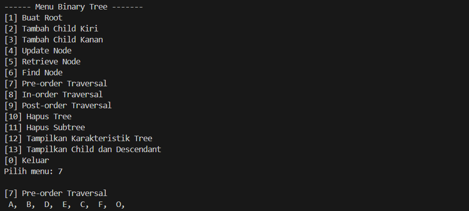

# <h1 align="center">Laporan Praktikum 9  Modul Graph and Tree</h1>
<p align="center">Iqbal bawani - 2311102130 </p>
 
#### Dasar Teori
Graf atau graph adalah struktur data yang digunakan untuk merepresentasikan  hubungan antara objek dalam bentuk node atau vertex dan sambungan antara node  tersebut dalam bentuk sisi atau edge. Graf terdiri dari simpul dan busur yang secara  matematis dinyatakan sebagai : G = (V, E) Dimana G adalah Graph, V adalah simpul atau vertex dan E sebagai sisi atau edge.
Dapat digambarkan:


Terdapat beberapa jenis graph, antara lain sebagai berikut</br>

1. Graph Berarah (Directed Graph)
Graph berarah adalah jenis graph di mana setiap sisi (edge) memiliki arah tertentu. Dalam graf berarah, sisi-sisi tersebut disebut panah (arc), yang menghubungkan sepasang simpul (vertex) dengan urutan tertentu, sehingga setiap urutan simpul mempunyai arti tersendiri. Berikut merupakan contoh graph berarah.
[ss_contohgraphberarah](\zgraphberarah.png)

2. Graph Tak Berarah (Undirected Graph)
Graph tak berarah adalah jenis graph di mana setiap sisi (edge) tidak memiliki arah tertentu. Pada graph tak berarah, urutan simpul dalam sebuah busur tidak dipentingkan. Berikut merupakan contoh graph tak berarah.


3. Graph Berbobot (Weight Graph)
Graph berbobot adalah jenis graph yang memiliki bobot pada setiap sisinya. Bobot sebuah busur dapat menyatakan panjang sebuah jalan dari 2 buah titik, jumlah rata-rata kendaraan perhari yang melalui sebuah jalan, dll. Berikut contoh graph berbobot.


Representasi graph menggunakan linked list adalah metode untuk menyimpan graph yang menghubungkan simpul-simpulnya melalui daftar terhubung, di mana setiap sisi graf memiliki bobot yang terkait. Berikut contoh representasi graph menggunakan linked list.
[ss_contohgraphlinkedlist](zgraphdanlinkedlist.png)
[ss_contohgraphlinkedlist](zgraphdanlinkedlist2.png)

### TREE
Pohon (tree) merupakan salah satu bentuk khusus dari struktur suatu graf. Misalkan A merupakan sebuah himpunan berhingga simpul (vertex) pada suatu graf G yang terhubung. Untuk setiap pasangan simpul di A dapat ditentukan suatu lintasan yang menghubungkan pasangan simpul tersebut. Suatu graf terhubung yang setiap pasangan simpulnya hanya dapat dihubungkan oleh suatu lintasan tertentu, maka graf tersebut dinamakan pohon (tree). Dengan kata lain, pohon (tree) merupakan graf tak-berarah yang terhubung dan tidak memiliki sirkuit. Contoh Tree
[ss_contohtree](zcontohtree.png)

Jenis-Jenis Tree
Struktur data tree dapat diklasifikasikan ke dalam 4 jenis, yaitu:

General tree
Struktur data tree yang tidak memiliki batasan jumlah node pada hierarki tree disebut General tree. Setiap simpul atau node bebas memiliki berapapun child node. Tree jenis adalah superset dari semua jenis tree.

Binary tree
Binary tree adalah jenis tree yang simpulnya hanya dapat memiliki paling banyak 2 simpul anak (child node). Kedua simpul tersebut biasa disebut simpul kiri (left node) dan simpul kanan (right node). Tree tipe ini lebih populer daripada jenis lainnya.

Balanced tree
Apabila tinggi dari subtree sebelah kiri dan subtree sebelah kanan sama atau kalaupun berbeda hanya berbeda 1, maka disebut sebagai balanced tree.

Binary search tree
Sesuai dengan namanya, Binary search tree digunakan untuk berbagai algoritma pencarian dan pengurutan. Contohnya seperti AVL tree dan Red-black tree. Struktur data tree jenis ini memiliki nilai pada simpul sebelah kiri lebih kecil daripada induknya. Sedangkan nilai simpul sebelah kanan lebih besar dari induknya.


## Guided 
### 1. [Program Graph]
```C++
#include <iostream>
#include <iomanip>

using namespace std;

string simpul[7] ={
    "ciamis", "Bandung", "sBekasi", "Tasikmalaya", 
    "Cianjur", "Purwokerto", "Yogyakarta"
};

int busur [7][7] = {
    {0, 7, 8, 0, 0, 0, 0},
    {0, 0, 5, 0, 0, 15, 0},
    {0, 6, 0, 0, 5, 0, 0},
    {0, 5, 0, 0, 2, 4, 0},
    {23, 0, 0, 10, 0, 0, 8},
    {0, 0, 0, 0, 7, 0, 3},
    {0, 0, 0, 0, 9, 4, 0},
};
void tampilGraph(){
    for(int baris=0; baris <7; baris++){
        cout << " " << setiosflags(ios::left)<<
        setw(15)<< simpul[baris]<< " : " ;
        for (int kolom=0; kolom<7; kolom ++){
            if (busur[baris] [kolom]!=0){
                cout <<" " << simpul[kolom]<< " ( " << 
                busur[baris][kolom] << " ) ";
            }
        }cout << endl;
    }
}


int main(){
    tampilGraph();
    return 0;
}
```
## output 


Kode di atas mendefinisikan dan menampilkan representasi graf berbobot menggunakan bahasa pemrograman C++. Graf tersebut terdiri dari 7 simpul yang diidentifikasi oleh nama-nama kota: "Ciamis", "Bandung", "sBekasi", "Tasikmalaya", "Cianjur", "Purwokerto", dan "Yogyakarta". Matriks dua dimensi `busur` menggambarkan bobot atau jarak antara simpul-simpul tersebut; nilai nol menunjukkan tidak adanya busur (edge) antara dua simpul. Fungsi `tampilGraph` menampilkan graf dengan mencetak setiap simpul dan busur-busur yang terkait dengannya bersama dengan bobotnya. Hasilnya adalah daftar kota dengan koneksi langsung mereka dan jarak (bobot) yang diwakili oleh angka dalam kurung, yang membantu memvisualisasikan struktur graf tersebut.

## Guided 
### 2. [Program Tree]
```C++


#include <iostream>
#include <iomanip>
using namespace std;
struct Pohon
{
    char data;
    Pohon *left, *right, *parent;
};
Pohon *root, *baru;
void init()
{
    root = NULL;
}
bool isEmpty()
{
    return root == NULL;
}
void buatNode(char data)
{
    if (isEmpty())
    {
        root = new Pohon();
        root->data = data;
        root->left = NULL;
        root->right = NULL;
        root->parent = NULL;
        cout << "\n Node " << data << " berhasil dibuat sebagai root."
             << endl;
    }
    else
    {
        cout << "\n Tree sudah ada!" << endl;
    }
}
Pohon *insertLeft(char data, Pohon *node)
{
    if (isEmpty())
    {
        cout << "\n Buat tree terlebih dahulu!" << endl;
        return NULL;
    }
    else
    {
        if (node->left != NULL)
        {
            cout << "\n Node " << node->data << " sudah ada child  kiri!" << endl;
            return NULL;
        }
        else
        {
            Pohon *baru = new Pohon();
            baru->data = data;
            baru->left = NULL;
            baru->right = NULL;
            baru->parent = node;
            node->left = baru;
            cout << "\n Node " << data << " berhasil ditambahkan ke  child kiri " << baru->parent->data << endl;
            return baru;
        }
    }
}
Pohon *insertRight(char data, Pohon *node)
{
    if (isEmpty())
    {
        cout << "\n Buat tree terlebih dahulu!" << endl;
        return NULL;
    }
    else
    {
        if (node->right != NULL)
        {
            cout << "\n Node " << node->data << " sudah ada child kanan !" << endl;
                return NULL;
        }
        else
        {
            Pohon *baru = new Pohon();
            baru->data = data;
            baru->left = NULL;
            baru->right = NULL;
            baru->parent = node;
            node->right = baru;
            cout << "\n Node " << data << " berhasil ditambahkan ke child kanan " << baru->parent->data << endl;
                return baru;
        }
    }
}
void update(char data, Pohon *node)
{
    if (isEmpty())
    {
        cout << "\n Buat tree terlebih dahulu!" << endl;
    }
    else
    {
        if (!node)
        {
            cout << "\n Node yang ingin diganti tidak ada!!" << endl;
        }
        else
        {
            char temp = node->data;
            node->data = data;
                    cout
                << "\n Node " << temp << " berhasil diubah menjadi "
                << data << endl;
        }
    }
}
void retrieve(Pohon *node)
{
    if (isEmpty())
    {
        cout << "\n Buat tree terlebih dahulu!" << endl;
    }
    else
    {
        if (!node)
        {
            cout << "\n Node yang ditunjuk tidak ada!" << endl;
        }
        else
        {
            cout << "\n Data node : " << node->data << endl;
        }
    }
}
void find(Pohon *node)
{
    if (isEmpty())
    {
        cout << "\n Buat tree terlebih dahulu!" << endl;
    }
    else
    {
        if (!node)
        {
            cout << "\n Node yang ditunjuk tidak ada!" << endl;
        }
        else
        {
            cout << "\n Data Node : " << node->data << endl;
            cout << " Root : " << root->data << endl;
            if (!node->parent)
                cout << " Parent : (tidak punya parent)" << endl;
            else
                cout << " Parent : " << node->parent->data << endl;
            if (node->parent != NULL && node->parent->left != node &&
                node->parent->right == node)
                cout << " Sibling : " << node->parent->left->data << endl;
            else if (node->parent != NULL && node->parent->right != node && node->parent->left == node)
                cout << " Sibling : " << node->parent->right->data << endl;
            else
                cout << " Sibling : (tidak punya sibling)" << endl;
            if (!node->left)
                cout << " Child Kiri : (tidak punya Child kiri)" << endl;
            else
                cout << " Child Kiri : " << node->left->data << endl;
            if (!node->right)
                cout << " Child Kanan : (tidak punya Child kanan)" << endl;
            else
                cout << " Child Kanan : " << node->right->data << endl;
        }
    }
}
// Penelusuran (Traversal)
// preOrder
void preOrder(Pohon *node = root)
{
    if (isEmpty())
    {
        cout << "\n Buat tree terlebih dahulu!" << endl;
    }
    else
    {
        if (node != NULL)
        {
            cout << " " << node->data << ", ";
            preOrder(node->left);
            preOrder(node->right);
        }
    }
}
// inOrder
void inOrder(Pohon *node = root)
{
    if (isEmpty())
    {
        cout << "\n Buat tree terlebih dahulu!" << endl;
    }
    else
    {
        if (node != NULL)
        {
            inOrder(node->left);
            cout << " " << node->data << ", ";
            inOrder(node->right);
        }
    }
}
// postOrder
void postOrder(Pohon *node = root)
{
    if (isEmpty())
    {
        cout << "\n Buat tree terlebih dahulu!" << endl;
    }
    else
    {
        if (node != NULL)
        {
            postOrder(node->left);
            postOrder(node->right);
            cout << " " << node->data << ", ";
        }
    }
}
// Hapus Node Tree
void deleteTree(Pohon *node)
{
    if (isEmpty())
    {
        cout << "\n Buat tree terlebih dahulu!" << endl;
    }
    else
    {
        if (node != NULL)
        {
            if (node != root)
            {
                node->parent->left = NULL;
                node->parent->right = NULL;
            }
            deleteTree(node->left);
            deleteTree(node->right);
            if (node == root)
            {
                delete root;
                root = NULL;
            }
            else
            {
                delete node;
            }
        }
    }
}
// Hapus SubTree
void deleteSub(Pohon *node)
{
    if (isEmpty())
    {
        cout << "\n Buat tree terlebih dahulu!" << endl;
    }
    else
    {
        deleteTree(node->left);
        deleteTree(node->right);
        cout << "\n Node subtree " << node->data << " berhasi dihapus." << endl;
    }
}
// Hapus Tree
void clear()
{
    if (isEmpty())
    {
        cout << "\n Buat tree terlebih dahulu!!" << endl;
    }
    else
    {
        deleteTree(root);
        cout << "\n Pohon berhasil dihapus." << endl;
    }
}
// Cek Size Tree
int size(Pohon *node = root)
{
    if (isEmpty())
    {
        cout << "\n Buat tree terlebih dahulu!!" << endl;
        return 0;
    }
    else
    {
        if (!node)
        {
            return 0;
        }
        else
        {
            return 1 + size(node->left) + size(node->right);
        }
    }
}
// Cek Height Level Tree
int height(Pohon *node = root)
{
    if (isEmpty())
    {
        cout << "\n Buat tree terlebih dahulu!" << endl;
        return 0;
    }
    else
    {
        if (!node)
        {
            return 0;
        }
        else
        {
            int heightKiri = height(node->left);
            int heightKanan = height(node->right);
            if (heightKiri >= heightKanan)
            {
                return heightKiri + 1;
            }
            else
            {
                return heightKanan + 1;
            }
        }
    }
}
// Karakteristik Tree
void characteristic()
{
    cout << "\n Size Tree : " << size() << endl;
    cout << " Height Tree : " << height() << endl;
    cout << " Average Node of Tree : " << size() / height() << endl;
}
int main()
{

    buatNode('A');

    Pohon *nodeB, *nodeC, *nodeD, *nodeE, *nodeF, *nodeG, *nodeH, *nodeI, *nodeJ;

    nodeB = insertLeft('B', root); 
    nodeC = insertRight('C', root); 
    nodeD = insertLeft('D', nodeB); 
    nodeE = insertRight('E', nodeB); 
    nodeF = insertLeft('F', nodeC); 
    nodeG = insertLeft('G', nodeE); 
    nodeH = insertRight('H', nodeE); 
    nodeI = insertLeft('I', nodeG); 
    nodeJ = insertRight('J', nodeG); 

    update('Z', nodeC); 
    update('C', nodeC); 
    retrieve(nodeC); 
    find(nodeC); 

    cout << "\nSize Tree: " << size() << endl; 
    cout << "Height Tree: " << height() << endl; 
    cout << "Average Node of Tree : " << (float)size() / height() << endl;

    cout << "\nPreOrder:\n";
    preOrder();
    cout << endl;

    cout << "\nInOrder:\n";
    inOrder(); 
    cout << endl;

    cout << "\nPostOrder:\n";
    postOrder(); 
    cout << endl;


    return 0;
}
```
## output 
.png)
.png)

Kode di atas mendefinisikan struktur data pohon biner menggunakan kelas `Pohon` dalam bahasa C++. Setiap node dalam pohon memiliki data karakter dan pointer ke anak kiri, anak kanan, serta induknya. Fungsi-fungsi yang disediakan meliputi pembuatan pohon (`buatNode`), penambahan anak kiri (`insertLeft`) dan anak kanan (`insertRight`), pembaruan data pada node (`update`), pengambilan data node (`retrieve`), pencarian karakteristik node (`find`), serta berbagai metode penelusuran seperti pre-order, in-order, dan post-order. Ada juga fungsi untuk menghapus subtree (`deleteSub`), menghapus keseluruhan pohon (`clear`), serta menghitung ukuran (`size`) dan tinggi pohon (`height`). Fungsi `characteristic` menghitung dan mencetak ukuran, tinggi, dan rata-rata node dari pohon. Pada fungsi `main`, sebuah pohon dengan root 'A' dibuat dan beberapa node ditambahkan dengan struktur tertentu, kemudian dilakukan operasi pembaruan, penelusuran, dan pencetakan karakteristik pohon.


## Unguided 1
### 1.  [ Buatlah program graph dengan menggunakan inputan user untuk menghitung jarak dari sebuah kota ke kota lainnya]
[ss_soal1](zsoal_unguided1.png)
```C++

// IQBAL BAWANI
// 2311102130

#include <iostream>
#include <vector> // Pustaka untuk penggunaan kontainer vector
#include <string> // Pustaka untuk penggunaan tipe data string

using namespace std;

int main()
{
    int banyaksimpul_2311102130; // Deklarasi variabel untuk menyimpan jumlah simpul

    cout << "\n------- Menghitung Jarak Antar kota -------" << endl;

    cout << "\nSilakan masukan jumlah simpul : "; // Meminta pengguna memasukkan jumlah simpul
    cin >> banyaksimpul_2311102130;

    // Mendeklarasikan vektor untuk menyimpan nama-nama simpul
    vector<string> namasimpul(banyaksimpul_2311102130);
    // Mendeklarasikan matriks untuk menyimpan bobot (jarak) antar simpul
    vector<vector<int>> bobot(banyaksimpul_2311102130, vector<int>(banyaksimpul_2311102130));

    // Meminta pengguna memasukkan nama-nama simpul
    cout << "Silakan masukan nama simpul" << endl;
    for (int i = 0; i < banyaksimpul_2311102130; ++i)
    {
        // Meminta input nama simpul dari pengguna
        cout << "Simpul " << i + 1 << " : ";
        cin >> namasimpul[i]; // Membaca input nama simpul dan menyimpannya ke dalam vektor
    }

    // Meminta pengguna memasukkan bobot antar simpul
    cout << "Silakan masukkan bobot antar simpul" << endl;
    for (int i = 0; i < banyaksimpul_2311102130; ++i)
    {
        for (int j = 0; j < banyaksimpul_2311102130; ++j)
        {
            // Meminta input bobot (jarak) dari simpul i ke simpul j
            cout << namasimpul[i] << "--> " << namasimpul[j] << " = ";
            cin >> bobot[i][j]; // Membaca input bobot dan menyimpannya ke dalam matriks
        }
    }

    cout << endl; // Menambahkan baris baru untuk tampilan yang lebih rapi

    // Menampilkan tabel jarak antar simpul
    cout << "     "; 
    for (const string &Nama : namasimpul)
    {
        cout << Nama<< "  "; // Menampilkan nama-nama simpul sebagai header kolom
    }
    cout << endl;

    for (int i = 0; i < banyaksimpul_2311102130; ++i)
    {
        cout << namasimpul[i] << "     "; // Menampilkan nama simpul sebagai header baris
        for (int j = 0; j < banyaksimpul_2311102130; ++j)
        {
            cout << bobot[i][j] << "  "; // Menampilkan bobot (jarak) antar simpul
        }
        cout << endl;
    }

    return 0; // Mengembalikan nilai 0 untuk menandakan program berakhir dengan sukses
}

```
## output :


Program kode diatas implementasi untuk menghitung dan menampilkan jarak antar kota menggunakan struktur graf berbobot. Pengguna diminta untuk memasukkan jumlah simpul (kota), nama-nama simpul tersebut, dan bobot (jarak) antar simpul. Data disimpan dalam dua vektor: `namasimpul` untuk nama-nama simpul dan `bobot` untuk matriks yang menyimpan bobot antar simpul. Setelah semua data dimasukkan, program menampilkan tabel yang memperlihatkan jarak antar setiap pasangan simpul. Matriks `bobot` menyimpan nilai jarak dari simpul i ke simpul j pada posisi `bobot[i][j]`. Program ini berguna untuk memodelkan graf berbobot, di mana simpul-simpul merepresentasikan kota dan bobot pada sisi-sisi antara simpul merepresentasikan jarak antar kota tersebut. Dengan demikian, pengguna dapat dengan mudah mengidentifikasi dan menganalisis jarak antar kota dalam graf yang telah dibuat.


## Unguided 2
### 2.  [Modifikasi guided tree diatas dengan program menu menggunakan input data tree dari user dan berikan fungsi tambahan untuk menampilkan node child dan descendant dari node yang diinput kan!]

```C++
#include<iostream>
#include <iomanip>
#include <queue>
using namespace std;

// Struktur Pohon
struct Pohon {
    char data;
    Pohon *Kiri, *Kanan, *Parent_2311102130;
};
Pohon *Root, *Baru;

// Inisialisasi Root
void init_2311102130() {
    Root = NULL;
}

// Cek apakah tree kosong
bool isEmpty() {
    return Root == NULL;
}

// buatNode Baru sebagai Root
void buatNode_130(char data) {
    if (isEmpty()) {
        Root = new Pohon();
        Root->data = data;
        Root->Kiri = NULL;
        Root->Kanan = NULL;
        Root->Parent_2311102130 = NULL;
        cout << "\n[] Node " << data << " berhasil dibuat sebagai root." << endl;
    } else {
        cout << "\n[] Tree sudah ada!" << endl;
    }
}

// Insert Node ke kiri
Pohon *insertKiri(char data, Pohon *Node) {
    if (isEmpty()) {
        cout << "\n[] Buat tree terlebih dahulu!" << endl;
        return NULL;
    } else {
        if (Node->Kiri != NULL) {
            cout << "\n[] Node " << Node->data << " sudah ada child kiri!" << endl;
            return NULL;
        } else {
            Pohon *Baru = new Pohon();
            Baru->data = data;
            Baru->Kiri = NULL;
            Baru->Kanan = NULL;
            Baru->Parent_2311102130 = Node;
            Node->Kiri = Baru;
            cout << "\n[] Node " << data << " berhasil ditambahkan ke child kiri " << Baru->Parent_2311102130->data << endl;
            return Baru;
        }
    }
}

// Insert Node ke kanan
Pohon *insertKanan(char data, Pohon *Node) {
    if (isEmpty()) {
        cout << "\n[] Buat tree terlebih dahulu!" << endl;
        return NULL;
    } else {
        if (Node->Kanan != NULL) {
            cout << "\n[] Node " << Node->data << " sudah ada child kanan!" << endl;
            return NULL;
        } else {
            Pohon *Baru = new Pohon();
            Baru->data = data;
            Baru->Kanan = NULL;
            Baru->Parent_2311102130 = Node;
            Node->Kanan = Baru;
            cout << "\n[] Node " << data << " berhasil ditambahkan ke child kanan " << Baru->Parent_2311102130->data << endl;
            return Baru;
        }
    }
}

// Update Data
void update(char data, Pohon *Node) {
    if (isEmpty()) {
        cout << "\n[] Buat tree terlebih dahulu!" << endl;
    } else {
        if (!Node) {
            cout << "\n[] Node yang ingin diganti tidak ada!" << endl;
        } else {
            char temp = Node->data;
            Node->data = data;
            cout << "\n[] Node " << temp << " berhasil diubah menjadi " << data << endl;
        }
    }
}

// Retrieve 
void retrieve(Pohon *Node) {
    if (isEmpty()) {
        cout << "\n[] Buat tree terlebih dahulu!" << endl;
    } else {
        if (!Node) {
            cout << "\n[] Node yang ditunjuk tidak ada!" << endl;
        } else {
            cout << "\n[] Data Node : " << Node->data << endl;
        }
    }
}

// Find Node dan menampilkan informasi lengkap
void find(Pohon *Node) {
    if (isEmpty()) {
        cout << "\n[] Buat tree terlebih dahulu!" << endl;
    } else {
        if (!Node) {
            cout << "\n[] Node yang ditunjuk tidak ada!" << endl;
        } else {
            cout << "\n[] Data Node : " << Node->data << endl;
            cout << "[] Root : " << Root->data << endl;
            if (!Node->Parent_2311102130)
                cout << "[] Parent : (tidak punya parent)" << endl;
            else
                cout << "[] Parent : " << Node->Parent_2311102130->data << endl;
            if (Node->Parent_2311102130 != NULL && Node->Parent_2311102130->Kiri != Node && Node->Parent_2311102130->Kanan == Node)
                cout << "[] Sibling : " << Node->Parent_2311102130->Kiri->data << endl;
            else if (Node->Parent_2311102130 != NULL && Node->Parent_2311102130->Kanan != Node && Node->Parent_2311102130->Kiri == Node)
                cout << "[] Sibling : " << Node->Parent_2311102130->Kanan->data << endl;
            else
                cout << "[] Sibling : (tidak punya sibling)" << endl;
            if (!Node->Kiri)
                cout << "[] Child Kiri : (tidak punya Child kiri)" << endl;
            else
                cout << "[] Child Kiri : " << Node->Kiri->data << endl;
            if (!Node->Kanan)
                cout << "[] Child Kanan : (tidak punya Child kanan)" << endl;
            else
                cout << "[] Child Kanan : " << Node->Kanan->data << endl;
        }
    }
}

// Pre-order traversal
void preOrder(Pohon *Node = Root) {
    if (isEmpty()) {
        cout << "\n[] Buat tree terlebih dahulu!" << endl;
    } else {
        if (Node != NULL) {
            cout << " " << Node->data << ", ";
            preOrder(Node->Kiri);
            preOrder(Node->Kanan);
        }
    }
}

// In-order traversal
void inOrder(Pohon *Node = Root) {
    if (isEmpty()) {
        cout << "\n[] Buat tree terlebih dahulu!" << endl;
    } else {
        if (Node != NULL) {
            inOrder(Node->Kiri);
            cout << " " << Node->data << ", ";
            inOrder(Node->Kanan);
        }
    }
}

// Post-order traversal
void postOrder(Pohon *Node = Root) {
    if (isEmpty()) {
        cout << "\n[] Buat tree terlebih dahulu!" << endl;
    } else {
        if (Node != NULL) {
            postOrder(Node->Kiri);
            postOrder(Node->Kanan);
            cout << " " << Node->data << ", ";
        }
    }
}

// Hapus tree secara rekursif
void deleteTree(Pohon *Node) {
    if (isEmpty()) {
        cout << "\n[] Buat tree terlebih dahulu!" << endl;
    } else {
        if (Node != NULL) {
            if (Node != Root) {
                Node->Parent_2311102130->Kiri = NULL;
                Node->Parent_2311102130->Kanan = NULL;
            }
            deleteTree(Node->Kiri);
            deleteTree(Node->Kanan);
            if (Node == Root) {
                delete Root;
                Root = NULL;
            } else {
                delete Node;
            }
        }
    }
}

// Hapus subtree dari Node tertentu
void deleteSub(Pohon *Node) {
    if (isEmpty()) {
        cout << "\n[] Buat tree terlebih dahulu!" << endl;
    } else {
        deleteTree(Node->Kiri);
        deleteTree(Node->Kanan);
        cout << "\n[] Node subtree " << Node->data << " berhasil dihapus." << endl;
    }
}

// Hapus seluruh tree
void clear() {
    if (isEmpty()) {
        cout << "\n[] Buat tree terlebih dahulu!" << endl;
    } else {
        deleteTree(Root);
        cout << "\n[] Pohon berhasil dihapus." << endl;
    }
}

// Hitung size tree
int size(Pohon *Node = Root) {
    if (isEmpty()) {
        cout << "\n[] Buat tree terlebih dahulu!" << endl;
        return 0;
    } else {
        if (!Node) {
            return 0;
        } else {
            return 1 + size(Node->Kiri) + size(Node->Kanan);
        }
    }
}

// Hitung height tree
int height(Pohon *Node = Root) {
    if (isEmpty()) {
        cout << "\n[] Buat tree terlebih dahulu!" << endl;
        return 0;
    } else {
        if (!Node) {
            return 0;
        } else {
            int heightKiri = height(Node->Kiri);
            int heightKanan = height(Node->Kanan);
            if (heightKiri >= heightKanan) {
                return heightKiri + 1;
            } else {
                return heightKanan + 1;
            }
        }
    }
}

// Tampilkan karakteristik tree
void characteristic() {
    cout << "\n>> Ukuran Tree : " << size() << endl;
    cout << ">> Tinggi Tree : " << height() << endl;
    cout << ">> Rata-rata Node di Tree : " << size() / height() << endl;
}

// Tampilkan child dan descendant dari Node tertentu
void showChildAndDescendant(Pohon *Node) {
    if (isEmpty()) {
        cout << "\n[] Buat tree terlebih dahulu!" << endl;
    } else if (!Node) {
        cout << "\n[] Node yang ditunjuk tidak ada!" << endl;
    } else {
        // Tampilkan child
        cout << "\n[] Node : " << Node->data << endl;
        if (Node->Kiri != NULL) {
            cout << "Child Kiri : " << Node->Kiri->data << endl;
        } else {
            cout << "Child Kiri : NULL" << endl;
        }
        if (Node->Kanan != NULL) {
            cout << "Child Kanan : " << Node->Kanan->data << endl;
        } else {
            cout << "Child Kanan : NULL" << endl;
        }
        // Tampilkan descendant
        cout << "Descendant : ";
        queue<Pohon *> q;
        if (Node->Kiri != NULL) {
            q.push(Node->Kiri);
        }
        if (Node->Kanan != NULL) {
            q.push(Node->Kanan);
        }
        while (!q.empty()) {
            Pohon *current = q.front();
            q.pop();
            cout << current->data << " ";
            if (current->Kiri != NULL) {
                q.push(current->Kiri);
            }
            if (current->Kanan != NULL) {
                q.push(current->Kanan);
            }
        }
        cout << endl;
    }
}

int main() {
    int Pilihan;
    char data, dataUpdate;
    Pohon *Node = NULL;
    init_2311102130();

    do {
        cout << "\n------ Menu Binary Tree -------\n";
        cout << "[1] Buat Root\n";
        cout << "[2] Tambah Child Kiri\n";
        cout << "[3] Tambah Child Kanan\n";
        cout << "[4] Update Node\n";
        cout << "[5] Retrieve Node\n";
        cout << "[6] Find Node\n";
        cout << "[7] Pre-order Traversal\n";
        cout << "[8] In-order Traversal\n";
        cout << "[9] Post-order Traversal\n";
        cout << "[10] Hapus Tree\n";
        cout << "[11] Hapus Subtree\n";
        cout << "[12] Tampilkan Karakteristik Tree\n";
        cout << "[13] Tampilkan Child dan Descendant\n";
        cout << "[0] Keluar\n";
        cout << "Pilih menu: ";
        cin >> Pilihan;

        switch (Pilihan) {
        case 1:
            cout << "\n[1] Buat Root" << endl;
            if (isEmpty()) {
                cout << "Masukkan data: ";
                cin >> data;
                buatNode_130(data);
            } else {
                cout << "\n[] Root sudah ada!" << endl;
            }
            break;
        case 2:
            cout << "\n[2] Tambah Child Kiri" << endl;
            if (isEmpty()) {
                cout << "\n[] Buat tree terlebih dahulu!" << endl;
            } else {
                cout << "Masukkan data parent: ";
                cin >> data;
                queue<Pohon *> q;
                q.push(Root);
                while (!q.empty()) {
                    Pohon *current = q.front();
                    q.pop();
                    if (current->data == data) {
                        Node = current;
                        break;
                    }
                    if (current->Kiri)
                        q.push(current->Kiri);
                    if (current->Kanan)
                        q.push(current->Kanan);
                }
                if (Node) {
                    cout << "Masukkan data child kiri: ";
                    cin >> data;
                    insertKiri(data, Node);
                } else {
                    cout << "\n[] Parent tidak ditemukan!" << endl;
                }
            }
            break;
        case 3:
            cout << "\n[3] Tambah Child Kanan" << endl;
            if (isEmpty()) {
                cout << "\n[] Buat tree terlebih dahulu!" << endl;
            } else {
                cout << "Masukkan data parent: ";
                cin >> data;
                queue<Pohon *> q;
                q.push(Root);
                while (!q.empty()) {
                    Pohon *current = q.front();
                    q.pop();
                    if (current->data == data) {
                        Node = current;
                        break;
                    }
                    if (current->Kiri)
                        q.push(current->Kiri);
                    if (current->Kanan)
                        q.push(current->Kanan);
                }
                if (Node) {
                    cout << "Masukkan data child kanan: ";
                    cin >> data;
                    insertKanan(data, Node);
                } else {
                    cout << "\n[] Parent tidak ditemukan!" << endl;
                }
            }
            break;
        case 4:
            cout << "\n[4] Update Node" << endl;
            if (isEmpty()) {
                cout << "\n[] Buat tree terlebih dahulu!" << endl;
            } else {
                cout << "Masukkan data node yang akan diupdate: ";
                cin >> data;
                cout << "Masukkan data baru: ";
                cin >> dataUpdate;
                queue<Pohon *> q;
                q.push(Root);
                while (!q.empty()) {
                    Pohon *current = q.front();
                    q.pop();
                    if (current->data == data) {
                        Node = current;
                        break;
                    }
                    if (current->Kiri)
                        q.push(current->Kiri);
                    if (current->Kanan)
                        q.push(current->Kanan);
                }
                if (Node) {
                    update(dataUpdate, Node);
                } else {
                    cout << "\n[] Node tidak ditemukan!" << endl;
                }
            }
            break;
        case 5:
            cout << "\n[5] Retrieve Node" << endl;
            if (isEmpty()) {
                cout << "\n[] Buat tree terlebih dahulu!" << endl;
            } else {
                cout << "Masukkan data node yang akan ditampilkan: ";
                cin >> data;
                queue<Pohon *> q;
                q.push(Root);
                while (!q.empty()) {
                    Pohon *current = q.front();
                    q.pop();
                    if (current->data == data) {
                        Node = current;
                        break;
                    }
                    if (current->Kiri)
                        q.push(current->Kiri);
                    if (current->Kanan)
                        q.push(current->Kanan);
                }
                if (Node) {
                    retrieve(Node);
                } else {
                    cout << "\n[] Node tidak ditemukan!" << endl;
                }
            }
            break;
        case 6:
            cout << "\n[6] Find Node" << endl;
            if (isEmpty()) {
                cout << "\n[] Buat tree terlebih dahulu!" << endl;
            } else {
                cout << "Masukkan data node yang akan dicari: ";
                cin >> data;
                queue<Pohon *> q;
                q.push(Root);
                while (!q.empty()) {
                    Pohon *current = q.front();
                    q.pop();
                    if (current->data == data) {
                        Node = current;
                        break;
                    }
                    if (current->Kiri)
                        q.push(current->Kiri);
                    if (current->Kanan)
                        q.push(current->Kanan);
                }
                if (Node) {
                    find(Node);
                } else {
                    cout << "\n[] Node tidak ditemukan!" << endl;
                }
            }
            break;
        case 7:
            cout << "\n[7] Pre-order Traversal" << endl;
            preOrder();
            break;
        case 8:
            cout << "\n[8] In-order Traversal" << endl;
            inOrder();
            break;
        case 9:
            cout << "\n[9] Post-order Traversal" << endl;
            postOrder();
            break;
        case 10:
            cout << "\n[10] Hapus Tree" << endl;
            clear();
            break;
        case 11:
            cout << "\n[11] Hapus Subtree" << endl;
            if (isEmpty()) {
                cout << "\n[] Buat tree terlebih dahulu!" << endl;
            } else {
                cout << "Masukkan data node untuk subtree yang akan dihapus: ";
                cin >> data;
                queue<Pohon *> q;
                q.push(Root);
                while (!q.empty()) {
                    Pohon *current = q.front();
                    q.pop();
                    if (current->data == data) {
                        Node = current;
                        break;
                    }
                    if (current->Kiri)
                        q.push(current->Kiri);
                    if (current->Kanan)
                        q.push(current->Kanan);
                }
                if (Node) {
                    deleteSub(Node);
                } else {
                    cout << "\n[] Node tidak ditemukan!" << endl;
                }
            }
            break;
        case 12:
            cout << "\n[12] Tampilkan Karakteristik Tree" << endl;
            characteristic();
            break;
        case 13:
            cout << "\n[13] Tampilkan Child dan Descendant" << endl;
            if (isEmpty()) {
                cout << "\n[] Buat tree terlebih dahulu!" << endl;
            } else {
                cout << "Masukkan data node untuk menampilkan Child dan Descendant: ";
                cin >> data;
                queue<Pohon *> q;
                q.push(Root);
                while (!q.empty()) {
                    Pohon *current = q.front();
                    q.pop();
                    if (current->data == data) {
                        Node = current;
                        break;
                    }
                    if (current->Kiri)
                        q.push(current->Kiri);
                    if (current->Kanan)
                        q.push(current->Kanan);
                }
                if (Node) {
                    showChildAndDescendant(Node);
                } else {
                    cout << "\n[] Node tidak ditemukan!" << endl;
                }
            }
            break;
        case 0:
            cout << "\n[0] Keluar" << endl;
            break;
        default:
            cout << "\n[] Pilihan tidak valid!" << endl;
            break;
        }
    } while (Pilihan != 0);

    return 0;
}


```
### Output:
## buat akar node 

## tambah child kiri dan kanan 


## ubah atau update node

## tunjuk node

## cari node 

## preorder, inorder, dan postorder



Kode diatas implementasi dari sebuah pohon biner (binary tree) dalam bahasa C++. Pohon biner adalah struktur data yang terdiri dari simpul-simpul (nodes) di mana setiap simpul memiliki maksimal dua anak, yaitu anak kiri (left child) dan anak kanan (right child). Program ini mendukung berbagai operasi seperti membuat pohon, menambahkan simpul, memperbarui data simpul, menghapus pohon, dan melakukan traversal pohon.</br>
Struktur Pohon mendefinisikan simpul dengan tiga pointer: Kiri untuk anak kiri, Kanan untuk anak kanan, dan Parent_2311102130 untuk menunjuk ke parent-nya. data menyimpan nilai simpul tersebut. Root adalah pointer ke simpul root dari pohon. Fungsi init_2311102130() menginisialisasi Root menjadi NULL, menandakan bahwa pohon awalnya kosong. Fungsi isEmpty() mengembalikan true jika Root adalah NULL, menandakan bahwa pohon kosong. Fungsi buatNode_130() membuat simpul baru dan menjadikannya sebagai root jika pohon masih kosong. Jika pohon sudah ada, akan menampilkan pesan bahwa pohon sudah ada.Fungsi insertKiri() dan insertKanan() menambahkan simpul baru sebagai anak kiri atau anak kanan dari simpul yang ditentukan (Node). Jika Node sudah memiliki anak kiri atau kanan, fungsi akan menampilkan pesan kesalahan. Fungsi update() mengubah nilai data pada simpul Node menjadi data yang baru. Fungsi retrieve() menampilkan data dari simpul Node yang ditunjuk.Fungsi find() menampilkan informasi lengkap tentang simpul Node yang ditunjuk, termasuk data, parent, sibling, dan child-nya. Fungsi-fungsi ini menyediakan operasi dasar untuk manipulasi pohon biner seperti pembuatan, penambahan, pembaruan, pencarian, traversal, dan penghapusan pohon.


### Kesimpulan
Kesimpulannya,</br>
Graph dan tree adalah dua struktur data yang esensial dalam ilmu komputer, masing-masing dengan karakteristik dan kegunaannya yang spesifik. Graph adalah struktur data yang terdiri dari simpul (nodes atau vertices) dan sisi (edges) yang menghubungkan simpul-simpul tersebut. Graph dapat diimplementasikan menggunakan berbagai cara, seperti daftar ketetanggaan (adjacency list) dan matriks ketetanggaan (adjacency matrix). Terdapat beberapa jenis graph, termasuk directed graph (graf berarah) di mana setiap sisi memiliki arah, undirected graph (graf tak berarah) yang tidak memiliki arah pada sisi-sisinya, weighted graph (graf berbobot) yang memiliki bobot pada sisi-sisinya, dan unweighted graph (graf tak berbobot) yang tidak memiliki bobot. Operasi dasar pada graph meliputi traversal seperti Depth-First Search (DFS) dan Breadth-First Search (BFS), serta pencarian jalur menggunakan algoritma seperti Dijkstra.

Di sisi lain, tree adalah struktur data yang merupakan jenis khusus dari graph. Tree adalah graf tak berarah yang terhubung tanpa siklus dan memiliki satu simpul yang disebut root, dari mana semua simpul lain bercabang. Tree memiliki hubungan hierarkis antar simpul, termasuk parent, child, sibling, dan descendant. Ada berbagai jenis tree, seperti binary tree (pohon biner) di mana setiap simpul memiliki maksimal dua anak, dan binary search tree (BST) yang memenuhi kondisi bahwa setiap anak kiri memiliki nilai lebih kecil dari parent dan setiap anak kanan memiliki nilai lebih besar dari parent. Operasi dasar pada tree meliputi penambahan (insertion), penghapusan (deletion), pembaruan (update), dan penelusuran (traversal) seperti pre-order, in-order, dan post-order traversal. Tree juga memungkinkan pencarian yang efisien dan memiliki properti bahwa tree dengan n nodes selalu memiliki n-1 edges, serta tidak mengandung siklus.

Secara umum, graph lebih fleksibel dalam menghubungkan simpul-simpul tanpa batasan pada struktur atau arah hubungan, dan dapat mengandung siklus serta pola yang kompleks. Tree, dengan strukturnya yang lebih teratur dan hierarkis, sangat berguna untuk merepresentasikan data dengan hubungan hierarkis dan untuk operasi pencarian yang efisien. Kedua struktur data ini sangat penting dan berguna dalam berbagai aplikasi dan permasalahan di bidang ilmu komputer.

## Referensi
[1]Buhaerah, M., Busrah, Z., & Sanjaya, H. (2022). "Teori Graf dan Aplikasinya". Makassar: LSQ Makassar..</br>
[2]PUTRA, Muhammad Taufik Dwi; MUNAWIR, Munawir; YUNIARTI, Ana Rahma. BELAJAR PEMROGRAMAN LANJUT DENGAN C++. 2023.</br>
[3]Muhammad Nugraha, 2021. "Dasar Pemrograman Dengan C++, Materi Paling Dasar untuk Menjadi Programmer Berbagai Platform.

