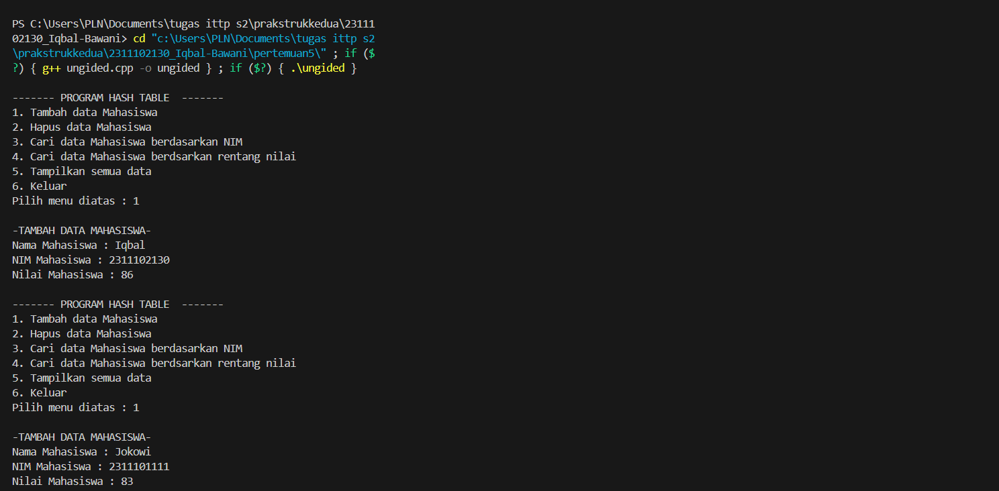

# <h1 align="center">Laporan Praktikum Modul Hash Table</h1>
<p align="center">Iqbal bawani - 2311102130 </p>
 
## Dasar Teori

Pengertian Hash Table
Hash Table adalah struktur data yang mengorganisir data ke dalam pasangan kunci-nilai. Hash table biasanya terdiri dari dua komponen utama: array (atau vektor) dan fungsi hash. Hashing adalah teknik untuk mengubah rentang nilai kunci menjadi rentang indeks array. Array menyimpan data dalam slot-slot yang disebut bucket. Setiap bucket dapat menampung satu atau beberapa item data. Fungsi hash digunakan untuk menghasilkan nilai unik dari setiap item data, yang digunakan sebagai indeks array. Dengan cara ini, hash table memungkinkan pencarian data dalam waktu yang konstan (O(1)) dalam kasus terbaik. Sistem hash table bekerja dengan cara mengambil input kunci dan memetakkannya ke nilai indeks array menggunakan fungsi hash. Kemudian, data disimpan pada posisi indeks array yang dihasilkan oleh fungsi hash. Ketika data perlu dicari, input kunci dijadikan sebagai parameter untuk fungsi hash, dan posisi indeks array yang dihasilkan digunakan untuk mencari data. Dalam kasus hash collision, di mana dua atau lebih data memiliki nilai hash yang sama, hash table menyimpan data tersebut dalam slot yang sama dengan Teknik yang disebut chaining. Hashing adalah metode mengubah kunci atau string menjadi angka. Dalam dunia pemrograman, pengguna sering menggunakan teknik hashing ini untuk membuat struktur data yang disebut tabel hash </br>

Kelebihan Hash table meliputi efisiensi waktu operasi seperti insert, delete, dan search yang cepat dengan waktu rata-rata O(1). Selain itu, hash table ideal untuk data dengan frekuensi operasi yang tinggi dan menggunakan algoritma hashing untuk mempercepat pencarian data. Selain efisien dalam penggunaan memori dengan efisiensi tinggi, hash table juga memiliki teknik-teknik seperti open hashing, separate chaining, dan closed hashing untuk mengurangi kemungkinan collision dalam penyimpanan data. </br>
Kekurangan menggunakan Hash table memiliki kekurangan seperti kemungkinan collision yang memperlambat pencarian dan memakan lebih banyak memori, serta penggunaan memori yang lebih besar karena menggunakan array. Proses hashing dan pengelolaannya mengonsumsi lebih banyak prosesor, waktu, dan kompleksitas algoritma dibandingkan dengan data biasa, termasuk saat operasi penambahan, penghapusan, dan pengujian data.


## Guided 

### 1. [Guided1]

```
#include <iostream>
using namespace std;

const int MAX_SIZE = 10;

// Fungsi hash sederhana
int hash_func(int key) {
    return key % MAX_SIZE;
}

// Struktur data untuk setiap node
struct Node {
    int key;
    int value;
    Node* next;
    Node(int key, int value) : key(key), value(value), next(nullptr) {}
};

// Class hash table
class HashTable {
private:
    Node** table;

public:
    HashTable() {
        table = new Node*[MAX_SIZE]();
    }

    ~HashTable() {
        for (int i = 0; i < MAX_SIZE; i++) {
            Node* current = table[i];
            while (current != nullptr) {
                Node* temp = current;
                current = current->next;
                delete temp;
            }
        }
        delete[] table;
    }

    // Insertion
    void insert(int key, int value) {
        int index = hash_func(key);
        Node* current = table[index];
        while (current != nullptr) {
            if (current->key == key) {
                current->value = value;
                return;
            }
            current = current->next;
        }
        Node* node = new Node(key, value);
        node->next = table[index];
        table[index] = node;
    }

    // Searching
    int get(int key) {
        int index = hash_func(key);
        Node* current = table[index];
        while (current != nullptr) {
            if (current->key == key) {
                return current->value;
            }
            current = current->next;
        }
        return -1;
    }

    // Deletion
    void remove(int key) {
        int index = hash_func(key);
        Node* current = table[index];
        Node* prev = nullptr;
        while (current != nullptr) {
            if (current->key == key) {
                if (prev == nullptr) {
                    table[index] = current->next;
                } else {
                    prev->next = current->next;
                }
                delete current;
                return;
            }
            prev = current;
            current = current->next;
        }
    }

    // Traversal
    void traverse() {
        for (int i = 0; i < MAX_SIZE; i++) {
            Node* current = table[i];
            while (current != nullptr) {
                cout << current->key << ": " << current->value << endl;
                current = current->next;
            }
        }
    }
};

int main() {
    HashTable ht;
    // Insertion
    ht.insert(1, 10);
    ht.insert(2, 20);
    ht.insert(3, 30);
    // Searching
    cout << "Get key 1: " << ht.get(1) << endl;
    cout << "Get key 4: " << ht.get(4) << endl;
    // Deletion
    ht.remove(4);
    // Traversal
    ht.traverse();
    return 0;
}

```
Kode diatas merupakan implementasi sederhana dari struktur data hash table dalam bahasa C++.Fungsi hash sederhana (`hash_func`) digunakan untuk mengonversi kunci (dalam hal ini, bilangan bulat) menjadi indeks dalam larik hash. Dalam implementasi ini, moduloperasi digunakan untuk mendapatkan indeks, dan ini disebut fungsi hash modulus. Setiap node dalam linked list (`Node`) terdiri dari dua bagian: kunci (`key`) dan nilai (`value`). Ketika pasangan kunci-nilai dimasukkan ke dalam hash table melalui metode `insert`, kunci tersebut dihash untuk mendapatkan indeks, dan node baru dibuat dengan pasangan kunci-nilai tersebut. Node tersebut kemudian dimasukkan ke dalam linked list yang sesuai dengan indeks hashnya.Untuk mencari nilai yang terkait dengan kunci tertentu, metode `get` digunakan. Kunci tersebut dihash untuk mendapatkan indeks, dan pencarian dilakukan dalam linked list pada indeks tersebut. Jika kunci ditemukan, nilai yang sesuai dikembalikan; jika tidak, nilai `-1` dikembalikan. Penghapusan kunci dari hash table dilakukan melalui metode `remove`. Kunci dihash untuk mendapatkan indeks, dan pencarian dilakukan dalam linked list pada indeks tersebut. Jika kunci ditemukan, node yang sesuai dihapus dari linked list.Metode `traverse` digunakan untuk menelusuri semua pasangan kunci-nilai yang tersimpan dalam hash table. Ini mencetak semua pasangan kunci-nilai dalam hash table. Dalam fungsi `main`, beberapa operasi umum dilakukan pada hash table yang telah dibuat, termasuk penyisipan pasangan kunci-nilai, pencarian nilai berdasarkan kunci, penghapusan kunci, dan penelusuran seluruh hash table.


## 2. [Guided2]

```
#include <iostream>
#include <string>
#include <vector>
using namespace std;

const int TABLE_SIZE = 11;

class HashNode {
public:
    string name;
    string phone_number;
    HashNode(string name, string phone_number) {
        this->name = name;
        this->phone_number = phone_number;
    }
};

class HashMap {
private:
    vector<HashNode*> table[TABLE_SIZE];

public:
    int hashFunc(string key) {
        int hash_val = 0;
        for (char c : key) {
            hash_val += c;
        }
        return hash_val % TABLE_SIZE;
    }

    void insert(string name, string phone_number) {
        int hash_val = hashFunc(name);
        for (auto node : table[hash_val]) {
            if (node->name == name) {
                node->phone_number = phone_number;
                return;
            }
        }
        table[hash_val].push_back(new HashNode(name, phone_number));
    }

    void remove(string name) {
        int hash_val = hashFunc(name);
        for (auto it = table[hash_val].begin(); it != table[hash_val].end(); it++) {
            if ((*it)->name == name) {
                table[hash_val].erase(it);
                return;
            }
        }
    }

    string searchByName(string name) {
        int hash_val = hashFunc(name);
        for (auto node : table[hash_val]) {
            if (node->name == name) {
                return node->phone_number;
            }
        }
        return "";
    }

    void print() {
        for (int i = 0; i < TABLE_SIZE; i++) {
            cout << i << ": ";
            for (auto pair : table[i]) {
                if (pair != nullptr) {
                    cout << "[" << pair->name << ", " << pair->phone_number << "]";
                }
            }
            cout << endl;
        }
    }
};

int main() {
    HashMap employee_map;
    employee_map.insert("Mistah", "1234");
    employee_map.insert("Pastah", "5678");
    employee_map.insert("Ghana", "91011");

    cout << "Nomer Hp Mistah : " << employee_map.searchByName("Mistah") << endl;
    cout << "Phone Hp Pastah : " << employee_map.searchByName("Pastah") << endl;

    employee_map.remove("Mistah");
    cout << "Nomer Hp Mistah setelah dihapus : " << employee_map.searchByName("Mistah") << endl << endl;

    cout << "Hash Table : " << endl;
    employee_map.print();

    return 0;
}


```
Kode diatas adalah implementasi hash table dalam bahasa C++. Hash table digunakan untuk menyimpan pasangan nama dan nomor telepon, di mana nama digunakan sebagai kunci untuk mengakses nomor telepon yang sesuai. Fungsi `hashFunc` mengonversi nama menjadi indeks dalam larik hash menggunakan algoritma hash sederhana. Fungsi `insert` digunakan untuk menyisipkan pasangan nama-nomor telepon ke dalam hash table, sedangkan `remove` menghapus pasangan tersebut berdasarkan nama. Fungsi `searchByName` mencari nomor telepon berdasarkan nama yang diberikan. Program juga menyediakan fungsi `print` untuk mencetak isi hash table, yang merupakan serangkaian larik dinamis dari linked list. Melalui fungsi-fungsinya, program ini memperlihatkan cara memanfaatkan hash table untuk menyimpan dan mengelola data dengan efisien, serta operasi umum yang dapat dilakukan, seperti penyisipan, pencarian, dan penghapusan data.


## Unguided 
### 1.Implementasikan hash table untuk menyimpan data mahasiswa. Setiap mahasiswa memiliki NIM dan nillai. Implementasikan fungsi untuk menambah data baru,menghapus data dan mencari data berdasarkan NIM, dan mencari data berdasarkan nilai. Dengan ketentuan : </br>
 a. Setiap mahasiswa memiliki NIM dan nilai </br> 
b. Program memiliki tampilan pilihan menu berisi poin C </br> 
c. Implementasikan fungsi untuk manambahkan data baru, menghapus data, mencari data berdasarkan NIM, dan mencari data berdasarkan rentang nilai (80 - 90).

```C++
// UNGUIDED 1
// Iqbal Bawani
// S1 IF-11-D
// 2311102130
#include <iostream>
#include <vector>
#include <string>
using namespace std;

// Struck untuk setiap mahasiswa
struct Mahasiswa{
    string nama;
    string nimiqbal;
    int nilai_130;
};

//struck untuk setiap node dalam hash table
struct HashNode{
    Mahasiswa data;
    HashNode* next;
    HashNode(const Mahasiswa& data) : data(data), next(nullptr){}
};

// Kelas HashTable digunakan untuk merepresentasikan hash table yang menyimpan data mahasiswa.
class HashTable{
    private:
    static const int TABLE_SIZE = 10;// Ukuran tetap dari hash table
    vector<HashNode*>table[TABLE_SIZE];   // Array dari vektor HashNode* untuk menyimpan data dalam hash table

    // Fungsi hashFunc digunakan untuk menghasilkan indeks dalam hash table berdasarkan NIM mahasiswa.
    int hashFunc(const string& nimiqbal){
       
        int hashVal = 0;  // Menginisialisasi nilai hashVal sebagai 0
        // Mengiterasi melalui setiap karakter dalam NIM mahasiswa
        for(char c : nimiqbal){
            // Menambahkan nilai ASCII dari setiap karakter ke hashVal
            hashVal += c;
        }
        // Mengembalikan hasil modulus dari hashVal dengan ukuran hash table untuk mendapatkan indeks
        return hashVal % TABLE_SIZE;
    }

    public:
    // untuk menambahkan data mahasiswa kedalam hash table
    void insert(const Mahasiswa& mahasiswa){
        int index = hashFunc(mahasiswa.nimiqbal);
        HashNode* newNode = new HashNode(mahasiswa);
        newNode->next = table[index].size() > 0 ? table[index][0] : nullptr;
        table[index].insert(table[index].begin(),newNode);
    }
    //fungsi menghapus data mahasiswa  berdasarkan NIM
    void hapus(const string& nim){
        int index = hashFunc(nim);
        for(size_t i=0; i<table[index].size(); i++){
            if(table[index][i]->data.nimiqbal== nim){
                delete table[index][i];
                table[index].erase(table[index].begin()+i);
                return;
            }
        }
        cout << " mahasiswa  NIM : " << nim << " tidak ada" <<endl;
    }

    //fungsi untuk mencari data mahasiswa berdasarkan NIM
    Mahasiswa* caridarinim (const string& nim){
        int index = hashFunc(nim);
        for(size_t i = 0; i <table[index].size(); i++){
            if(table[index][i]->data.nimiqbal == nim){
                return &(table[index][i]->data);
            }
        }
        return nullptr;
    }

    // Fungsi mencari data mahasiswa berdasarkan rentang nilai
    vector<Mahasiswa*> caridarinilai(int minNilai, int maxNilai){
        vector<Mahasiswa*> result;
        for(int i = 0; i < TABLE_SIZE; i++){
            for(size_t j = 0; j < table[i].size(); j++){
                if(table[i][j]->data.nilai_130 >= minNilai && table[i][j]->data.nilai_130 <= maxNilai){
                    result.push_back(&(table[i][j]->data));
                }
            }
        }
        return result;
    }

    //Fungsi menampilkan semua data
    void tampilkan(){
        cout << "Data Mahasiswa yang ada dalam Hash Table : "<<endl;
        for(int i = 0; i < TABLE_SIZE; i++){
            for (size_t j = 0; j < table[i].size(); j++){
                Mahasiswa* mhs = &(table[i][j]->data);
                cout << "Nama Mahasiswa: " << mhs->nama << "\tNIM: " << mhs->nimiqbal << "\tNilai: " << mhs->nilai_130 << endl;
            }
        }
    }

};

int main(){
    HashTable hashTable;
    int pilih;

    menu:
    cout << "\n------- PROGRAM HASH TABLE  -------" << endl;
    cout << "1. Tambah data Mahasiswa"<<endl;
    cout << "2. Hapus data Mahasiswa"<<endl;
    cout << "3. Cari data Mahasiswa berdasarkan NIM"<<endl;
    cout << "4. Cari data Mahasiswa berdsarkan rentang nilai"<<endl;
    cout << "5. Tampilkan semua data"<<endl;
    cout << "6. Keluar"<<endl;
    cout << "Pilih menu diatas : "; cin >> pilih;
    cout << endl;

    switch(pilih){
        case 1 :{
            // menambahkan data mahasiswa
            Mahasiswa mhs;
            cout << "-TAMBAH DATA MAHASISWA-"<<endl;
            cout << "Nama Mahasiswa : ";
            cin >> mhs.nama;
            cout << "NIM Mahasiswa : ";
            cin >> mhs.nimiqbal;
            cout << "Nilai Mahasiswa : ";
            cin >> mhs.nilai_130;
            hashTable.insert(mhs);
            goto menu;
            cout << endl;
            break;
        }
        case 2 :{
            // menghapus data mahasiswa
            string nim;
            cout << "-HAPUS DATA MAHASISWA-"<<endl;
            cout << "Masukkan NIM untuk menghapus data Mahasiswa : ";
            cin >> nim;
            hashTable.hapus(nim);
            cout << " Mahasiswa NIM : " << nim << " dihapus"<<endl;
            goto menu;
            cout << endl;
            break;
        }
        case 3 :{
            // Mencari data mahasiswa berdasarkan NIM
            string nim;
            cout << "-CARI DATA MAHASISWA BERDASARKAN NIM-"<<endl;
            cout << "Masukkan NIM untuk mencari data Mahasiswa: ";
            cin >> nim;
            Mahasiswa* result = hashTable  .caridarinim(nim);
            if(result != nullptr){
                cout << "Data ditemukan!!"<<endl;
                cout << "Nama: " << result->nama << "\nNIM: " << result->nimiqbal << "\nNilai: " << result->nilai_130 <<endl;
            }else{
                cout << "Mahasiswa NIM " << nim << "Tidak ada"<<endl;
            }
            goto menu;
            cout << endl;
            break;
        }
        case 4 :{
            // mencari data mahasiswa berdasarkan rentang nilai (rentang nilai diinputkan user)
            int minNilai , maxNilai ;
            cout << "Masukan nilai mahasiswa yang ingin dicari!"<<endl;
            cout << "Nilai minimal : "; 
            cin >> minNilai;
            cout << "Nilai maksimal : ";
            cin >> maxNilai;
            cout << "Rentang nilai  " << minNilai << " hingga " << maxNilai << endl;
            vector<Mahasiswa*> result = hashTable.caridarinilai(minNilai, maxNilai);
            if(result.size() > 0){
                cout << "Data mahasiswa nilai " << minNilai << " hingga " << maxNilai << ":\n";
                for(Mahasiswa* mhs : result){
                    cout << "Nama Mahasiswa: " << mhs->nama << "\tNIM: " << mhs->nimiqbal << "\tNilai: "<< mhs->nilai_130 <<endl;
                }
            }else{
                cout << "Tidak ada mahasiswa "<<endl;
            }
            goto menu;
            cout << endl;
            break;
        }
        case 5 :{   
            hashTable.tampilkan();
            goto menu;
            cout << endl;
            break;
        }
        case 6 :
            cout << "Anda keluar dari program!"<<endl;
            break;
        default :
            cout << "Masukan pilihan yang ada "<<endl;
            goto menu;
    }
    return 0;
}


```
#### Output tambah data:



####  Tampil menu

#### Hapus 

#### Tampilan caridata melalu nim dan nilai


Kode diatas adalah implementasi dari struktur data hash table dalam bahasa pemrograman C++. Hash table digunakan untuk menyimpan data mahasiswa, di mana setiap data mahasiswa direpresentasikan oleh sebuah struktur `Mahasiswa` yang memiliki atribut nama, NIM, dan nilai. Hash table ini menggunakan metode hashing untuk menempatkan data pada indeks yang sesuai dalam array `table`. Fungsi hash `hashFunc` menghasilkan indeks berdasarkan NIM mahasiswa dengan menjumlahkan nilai ASCII dari setiap karakter NIM dan kemudian melakukan operasi modulus dengan ukuran hash table. Variabel `TABLE_SIZE` menentukan ukuran hash table, dan array `table` berukuran `TABLE_SIZE` digunakan untuk menyimpan pointer ke node-node hash. Setiap node `HashNode` memiliki data mahasiswa (`Mahasiswa`), serta pointer ke node berikutnya dalam kasus terjadinya tabrakan (collision). Program ini menyediakan operasi dasar seperti penambahan data mahasiswa, pencarian berdasarkan NIM, pencarian berdasarkan rentang nilai, penghapusan data berdasarkan NIM, dan penampilan seluruh data mahasiswa. Dalam implementasi ini, variabel-variabel yang signifikan termasuk `TABLE_SIZE` yang menentukan ukuran hash table, array `table` yang menyimpan data-data mahasiswa, serta struktur data `Mahasiswa` yang merepresentasikan data mahasiswa. Metode hashing yang digunakan memungkinkan pencarian, penambahan, dan penghapusan data dengan kompleksitas waktu rata-rata O(1) dalam kasus terbaik, dengan asumsi tidak ada konflik hash yang signifikan.


## Kesimpulan
Hash table merupakan struktur data yang memungkinkan penyimpanan data secara terkait dengan menerapkan teknik hash untuk memetakan kunci-nilai ke indeks dalam sebuah array. Fungsi hash digunakan untuk menghasilkan indeks unik untuk setiap kunci, yang memungkinkan pengaksesan data dalam waktu konstan, tidak bergantung pada ukuran data. Ini membuat hash table menjadi pilihan yang sangat efisien untuk operasi operasi seperti penyisipan, pencarian, dan penghapusan data. Membuat hash table melibatkan alokasi sejumlah memori dengan ukuran yang ditentukan dan menggunakan fungsi hash untuk menentukan lokasi penyimpanan data. Pentingnya penanganan bentrok (collision) dalam hash table, di mana dua kunci bisa saja menghasilkan nilai hash yang sama, diatasi dengan metode chaining atau probing. Chaining memanfaatkan linked list untuk menyimpan data dengan nilai hash yang sama, sementara probing mencari slot kosong dalam array untuk menempatkan data yang bertabrakan. Operasi utama pada hash table meliputi     pencarian, penyisipan, penghapusan, dan pembaruan data. Efisiensi hash table dipengaruhi oleh keefektifan fungsi hash yang digunakan dan ukuran dari hash table itu sendiri. Dengan menggunakan hash table, akses data dapat dipercepat, waktu operasi dapat ditingkatkan, dan data dapat disimpan serta diakses dengan lebih aman. Karena itu, hash table menjadi pilihan yang efisien untuk menyimpan dan mengelola data dalam berbagai konteks, mulai dari aplikasi pengarsipan hingga sistem pengolahan jaringan komputer.

## Referensi
[1]Dr. Joseph Teguh Santoso. Struktur Data dan ALgoritma. Semarang: Yayasan Prima Agus Teknik. 2021 <b/r>
[2] Muhammad Nugraha. Dasar Pemrograman Dengan C++ Materi Paling Dasar untuk Menjadi Programmer Berbagai Platform. Yogyakarta. 2021.<b/r>
[3]Universitas Indonesia. "Hash Table." SDA Universitas Indonesia, 2010, http://aren.cs.ui.ac.id/sda/resources/sda2010/15_hashtable.pdf.
